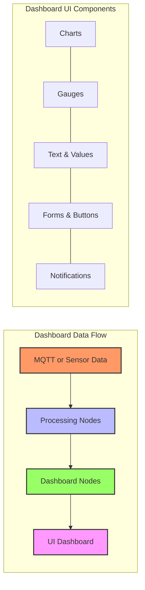

# Creating Dashboards in Node-RED

Node-RED Dashboard provides a set of nodes for quickly building a live dashboard with charts, gauges, and controls.



## Installation:
```
npm install node-red-dashboard
```

## Dashboard Nodes:
- UI Control: Button, Slider, Dropdown
- UI Display: Text, Gauge, Chart
- UI Form: Text Input, Numeric
- UI Layout: Group, Tab, Spacer

[Search Node-RED dashboard examples](https://www.google.com/search?q=node-red+dashboard+examples&tbm=isch)

## Presenter Notes (ข้อมูลสำหรับผู้บรรยาย)

> Key Takeaway: Node-RED Dashboard เป็นชุดโหนดที่ช่วยให้สร้างหน้า UI สวยงามได้อย่างรวดเร็ว โดยไม่ต้องเขียนโค้ด HTML/CSS/JavaScript มากนัก เหมาะสำหรับการแสดงผลข้อมูล IoT แบบเรียลไทม์

> การติดตั้ง Node-RED Dashboard:
> 1. ไปที่เมนู (≡) → Manage palette → Install
> 2. ค้นหา "node-red-dashboard" และคลิก Install
> 3. หรือติดตั้งผ่าน npm: `npm install node-red-dashboard`

> โครงสร้างของ Dashboard:
> - **Tabs**: แท็บหลักของแดชบอร์ด (เช่น Home, Sensors, Controls)
> - **Groups**: กลุ่มย่อยภายในแท็บ ใช้จัดระเบียบ widgets
> - **Widgets**: องค์ประกอบ UI ต่างๆ เช่น charts, gauges, buttons

> ประเภทของ Widget ที่สำคัญ:
> 1. **Charts**: แสดงข้อมูลในรูปแบบกราฟเส้น, กราฟแท่ง, หรือกราฟพื้นที่
> 2. **Gauges**: แสดงค่าแบบมาตรวัด เช่น เกจวัดอุณหภูมิ
> 3. **Text & Values**: แสดงข้อความหรือค่าตัวเลข
> 4. **Controls**: ปุ่ม สวิตช์ สไลเดอร์ สำหรับควบคุมอุปกรณ์
> 5. **Forms**: ฟอร์มสำหรับกรอกข้อมูล

> เมื่อสร้างแดชบอร์ดแล้ว สามารถเข้าถึงได้ที่ URL: http://[your-node-red-ip]:1880/ui

> ศัพท์เทคนิค: Dashboard, Widget, Tab, Group, Chart, Gauge, Slider, Switch, Form, Real-time visualization, UI (User Interface)
