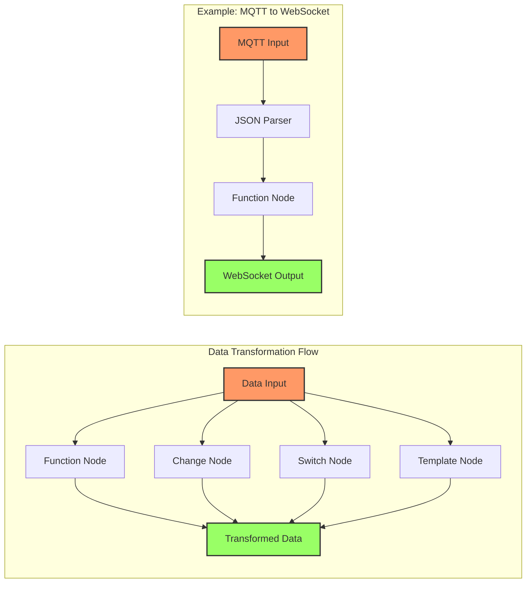

# Data Transformation in Node-RED

Transforming data between different formats and protocols is a key strength of Node-RED, especially for IoT applications.



## Key Transformation Nodes:

- **Function**: JavaScript code for custom logic
- **Change**: Simple value modifications
- **Switch**: Route messages based on rules
- **Template**: Format using Mustache templates
- **JSON**: Parse or create JSON data
- **CSV**: Convert between CSV and JSON

[Search Node-RED data transformation examples](https://www.google.com/search?q=node-red+data+transformation+examples&tbm=isch)

## Presenter Notes (ข้อมูลสำหรับผู้บรรยาย)

> Key Takeaway: การแปลงข้อมูลใน Node-RED สามารถทำได้หลากหลายรูปแบบ ทั้งการแปลงประเภทข้อมูล การกรอง การรวมข้อมูล โดยใช้โหนดต่างๆ เช่น Function, Change, Switch ซึ่งช่วยให้เชื่อมต่ออุปกรณ์หรือโปรโตคอลที่แตกต่างกันได้

> โหนดสำหรับการแปลงข้อมูลที่สำคัญ:
> 1. **Function Node** - ใช้เขียนโค้ด JavaScript เพื่อประมวลผลและแปลงข้อมูลแบบซับซ้อน
>    ```javascript
>    // ตัวอย่าง: แปลงข้อมูลเซนเซอร์จาก MQTT เป็นรูปแบบสำหรับ Dashboard
>    var temp = msg.payload.temperature;
>    var hum = msg.payload.humidity;
>    return [
>        {payload: temp, topic: "temperature"},
>        {payload: hum, topic: "humidity"}
>    ];
>    ```
> 2. **Change Node** - สำหรับการแปลงข้อมูลแบบง่าย เช่น การเปลี่ยนค่า set/delete/move properties
> 3. **Switch Node** - สำหรับการแยกข้อความตามเงื่อนไข (เหมือน if-else หรือ switch-case)
> 4. **JSON Node** - แปลงข้อความ JSON เป็น JavaScript object หรือในทางกลับกัน
> 5. **Template Node** - สร้างข้อความตามรูปแบบที่กำหนด เช่น HTML, XML, SQL

> กรณีตัวอย่าง: การแปลงข้อมูลจาก MQTT เป็น WebSocket
> 1. รับข้อมูลจาก MQTT topic เช่น "sensors/temp"
> 2. แปลงข้อมูลด้วย JSON node หรือ Function node ให้อยู่ในรูปแบบที่ต้องการ
> 3. ส่งข้อมูลที่แปลงแล้วไปยัง WebSocket เพื่อแสดงผลในเว็บแอปพลิเคชัน

> ศัพท์เทคนิค: Data transformation, Function node, JavaScript, JSON parsing, Property manipulation, Conditional logic, Data filtering, Templating
