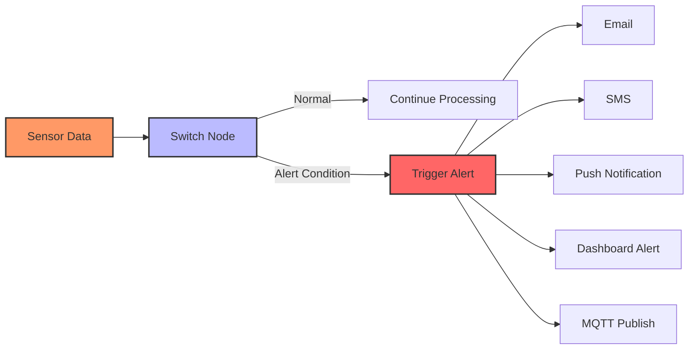

# Setting Up Alerts in Node-RED

Node-RED makes it easy to create alert systems that can notify users when sensor readings exceed thresholds or when specific events occur.

## Alert Types:
- Threshold alerts (temperature, humidity, etc.)
- Status change alerts (online/offline)
- Pattern detection alerts
- Time-based alerts

## Notification Methods:
- Email (node-red-node-email)
- LINE Notify (node-red-contrib-line-notify)
- Telegram (node-red-contrib-telegrambot)
- Push notifications (node-red-contrib-push)
- Dashboard notifications

[Search IoT alert system examples](https://www.google.com/search?q=iot+alert+notification+system+examples&tbm=isch)

## Presenter Notes (ข้อมูลสำหรับผู้บรรยาย)

> Key Takeaway: การสร้างระบบแจ้งเตือนใน Node-RED สามารถทำได้หลากหลายรูปแบบ โดยใช้โหนด Switch เพื่อตรวจสอบเงื่อนไข และส่งการแจ้งเตือนผ่านช่องทางต่างๆ เช่น Email, LINE, Telegram

> ขั้นตอนการสร้างระบบแจ้งเตือน:
> 1. **รับข้อมูล** - จากเซนเซอร์ผ่าน MQTT หรือแหล่งข้อมูลอื่นๆ
> 2. **ตรวจสอบเงื่อนไข** - ใช้โหนด Switch เพื่อตรวจสอบว่าข้อมูลเกินค่าที่กำหนดหรือไม่
>    - ตัวอย่าง: อุณหภูมิ > 30°C, ความชื้น < 20%, แรงดันไฟฟ้า < 220V
> 3. **สร้างข้อความแจ้งเตือน** - ใช้ Function หรือ Template node เพื่อสร้างข้อความแจ้งเตือน
> 4. **ส่งการแจ้งเตือน** - ผ่านช่องทางต่างๆ

> ช่องทางการแจ้งเตือนที่นิยม:
> 1. **Email** - ใช้โหนด node-red-node-email (ติดตั้งเพิ่มเติม)
> 2. **LINE Notify** - ใช้โหนด node-red-contrib-line-notify (ติดตั้งเพิ่มเติม)
>    - ต้องมี LINE Notify token (สร้างได้จาก https://notify-bot.line.me/)
> 3. **Telegram** - ใช้โหนด node-red-contrib-telegrambot (ติดตั้งเพิ่มเติม)
> 4. **Dashboard** - ใช้โหนด ui_notification สำหรับแสดงการแจ้งเตือนบนแดชบอร์ด
> 5. **MQTT** - ส่งข้อความแจ้งเตือนกลับไปยังอุปกรณ์อื่นๆ ผ่าน MQTT

> เทคนิคเพิ่มเติม:
> - การใช้ Delay node เพื่อป้องกันการแจ้งเตือนถี่เกินไป (rate limiting)
> - การใช้ Context เพื่อจดจำว่าได้ส่งการแจ้งเตือนไปแล้วหรือไม่
> - การกำหนดระดับความรุนแรง (severity) ของการแจ้งเตือน

> ศัพท์เทคนิค: Alert system, Threshold monitoring, Notification service, LINE Notify, Telegram bot, Push notification, Rate limiting, Alert severity
