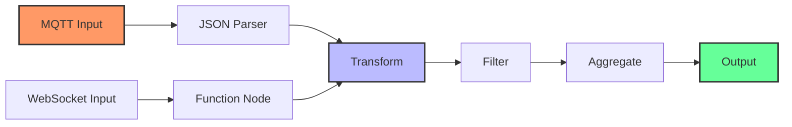

# Data Processing in Node-RED

Node-RED excels at transforming and processing data from various sources using function nodes and built-in processing capabilities.



## Common Data Processing Techniques:

- **Parsing**: Converting raw data to structured objects
- **Filtering**: Removing unwanted data points
- **Aggregation**: Combining multiple data points
- **Transformation**: Converting units or data formats
- **Enrichment**: Adding contextual information

[Search for Node-RED data processing examples](https://www.google.com/search?q=node-red+data+processing+json+examples&tbm=isch)

## Presenter Notes (ข้อมูลสำหรับผู้บรรยาย)

> Key Takeaway: Node-RED มีความสามารถในการประมวลผลข้อมูลที่หลากหลาย โดยใช้ function node และโหนดอื่นๆ เพื่อแปลงข้อมูลจากแหล่งต่างๆ ให้อยู่ในรูปแบบที่พร้อมใช้งาน

> ในการประมวลผลข้อมูลใน Node-RED ผู้ใช้สามารถ:
>
> 1. **แปลงข้อมูล JSON** - ใช้โหนด JSON เพื่อแปลงข้อมูลระหว่างรูปแบบ string และ object
>    ```javascript
>    // ตัวอย่างโค้ดใน Function Node
>    if (typeof msg.payload === 'string') {
>        msg.payload = JSON.parse(msg.payload);
>    }
>    return msg;
>    ```
>
> 2. **กรองข้อมูล** - ใช้โหนด Switch เพื่อกรองข้อมูลตามเงื่อนไข เช่น:
>    - เลือกเฉพาะข้อมูลที่มีค่าเกินกำหนด
>    - กรองข้อมูลที่ไม่สมบูรณ์
>    - แยกข้อมูลไปยังโหนดต่างๆ
>
> 3. **การรวมข้อมูล** - ใช้โหนด Join เพื่อรวมข้อมูลจากหลายแหล่ง
>    - รวมข้อมูลจากหลายเซ็นเซอร์
>    - คำนวณค่าเฉลี่ย
>    - สร้างชุดข้อมูลสำหรับการวิเคราะห์
>
> 4. **การเพิ่มคอนเท็กซ์** - ใช้ function node เพื่อเพิ่มข้อมูลอื่นๆ เช่น timestamp, ตำแหน่ง, หรือข้อมูลเพิ่มเติม

> ศัพท์เทคนิค: JSON parsing, Data transformation, Filtering, Aggregation, Data enrichment, Context, Function node, Switch node, Join node
