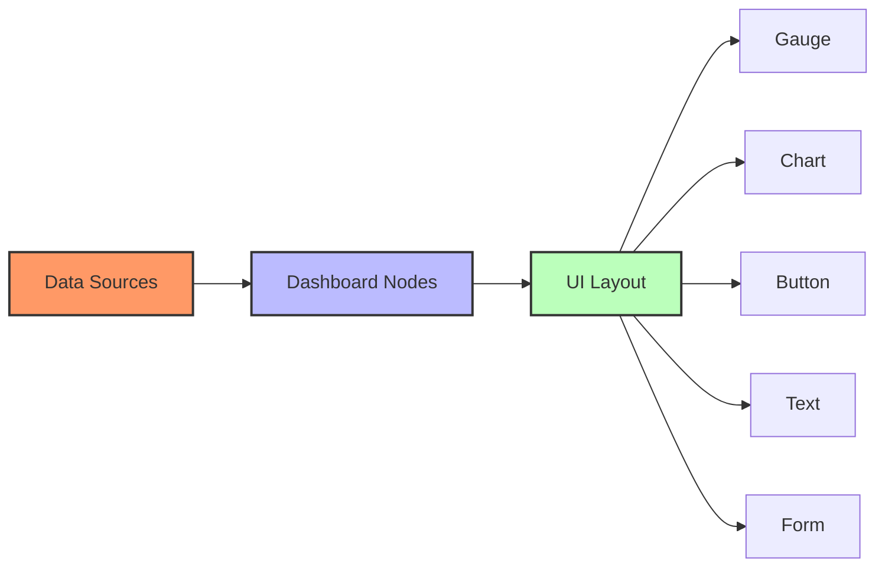

# Creating Dashboards with Node-RED

Node-RED Dashboard provides a set of nodes for quickly creating live data visualizations and user interfaces.

## Available Dashboard Elements:
- **Charts**: Line, Bar, Pie
- **Gauges & Meters**: Visualize numeric values
- **Controls**: Buttons, Sliders, Dropdowns
- **Input/Output**: Forms, Text displays, Notifications
- **Layout**: Groups, Tabs, Spacing

[Search Node-RED dashboard examples](https://www.google.com/search?q=node-red+dashboard+examples&tbm=isch)

## Presenter Notes (ข้อมูลสำหรับผู้บรรยาย)

> Key Takeaway: Node-RED Dashboard เป็นเครื่องมือที่ทรงพลังสำหรับสร้างแดชบอร์ดแสดงข้อมูล IoT แบบเรียลไทม์และสร้างส่วนติดต่อผู้ใช้ได้อย่างรวดเร็วโดยไม่ต้องเขียนโค้ด HTML, CSS หรือ JavaScript มากนัก

> วิธีการสร้างแดชบอร์ดใน Node-RED:
> 
> 1. **ติดตั้ง Dashboard Nodes** - ใช้ Manage Palette เพื่อติดตั้ง `node-red-dashboard`
>
> 2. **โครงสร้างแดชบอร์ด** 
>    - **Tab**: หน้าหลักของแดชบอร์ด
>    - **Group**: กลุ่มของ widget ที่เกี่ยวข้องกัน
>    - **Widget**: องค์ประกอบแสดงผลแต่ละชิ้น เช่น กราฟ, เกจ, ปุ่ม
>
> 3. **องค์ประกอบยอดนิยม**
>    - **Chart**: แสดงข้อมูลเป็นกราฟเส้น แท่ง หรือวงกลม
>    - **Gauge**: แสดงค่าตัวเลขในรูปแบบเกจวัด
>    - **Button**: สร้างปุ่มกดเพื่อส่งคำสั่ง
>    - **Slider**: ตัวปรับค่าแบบเลื่อน
>    - **Form**: ฟอร์มสำหรับกรอกข้อมูล
>
> 4. **การจัดรูปแบบ** - สามารถปรับขนาด สี ธีม และการจัดวาง widget ได้ตามต้องการ
>
> 5. **การเข้าถึง** - เข้าถึงได้ผ่าน URL: `http://<server-address>:1880/ui`

> ข้อควรระวัง: แดชบอร์ดที่มีข้อมูลมากเกินไปอาจทำให้ประสิทธิภาพลดลง ควรแบ่งข้อมูลเป็นแท็บต่างๆ และใช้การกรองข้อมูลเพื่อแสดงเฉพาะข้อมูลที่จำเป็น

> ศัพท์เทคนิค: Dashboard, Widget, Gauge, Chart, UI components, Real-time visualization, Tab, Group, Theme, Responsive design
