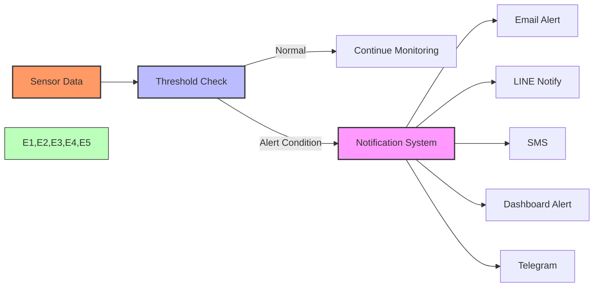

# Alert Systems and Notifications

Node-RED enables creating sophisticated alert systems that can trigger notifications through various channels when predefined conditions are met.



## Alert Types:
- Threshold-based alerts
- Pattern detection alerts
- Equipment failure detection
- Statistical anomalies
- Prediction-based warnings

[Search for IoT alert system examples](https://www.google.com/search?q=node+red+iot+alert+system+examples&tbm=isch)

## Presenter Notes (ข้อมูลสำหรับผู้บรรยาย)

> Key Takeaway: Node-RED สามารถสร้างระบบแจ้งเตือนอัตโนมัติที่มีประสิทธิภาพ โดยตรวจสอบข้อมูลแบบเรียลไทม์และส่งการแจ้งเตือนผ่านช่องทางต่างๆ เมื่อเกิดเหตุการณ์ที่กำหนด

> การสร้างระบบแจ้งเตือนใน Node-RED:
>
> 1. **ตรวจสอบเงื่อนไข** - ใช้โหนด Switch หรือ Function เพื่อตรวจสอบเงื่อนไข:
>    ```javascript
>    // ตัวอย่างการตรวจสอบค่าอุณหภูมิ
>    if (msg.payload.temperature > 30) {
>        msg.alert = true;
>        msg.alertMessage = "อุณหภูมิสูงเกินกำหนด: " + msg.payload.temperature + "°C";
>        return msg;
>    }
>    return null;  // ไม่ส่งข้อความถ้าไม่เข้าเงื่อนไข
>    ```
>
> 2. **ช่องทางการแจ้งเตือนยอดนิยม**:
>    - **LINE Notify**: ใช้โหนด `node-red-contrib-line-notify` (ต้องติดตั้งเพิ่มเติม)
>    - **Email**: ใช้โหนด Email ที่มีมาให้
>    - **Telegram**: ใช้โหนด `node-red-contrib-telegrambot`
>    - **Dashboard**: ใช้โหนด UI Text หรือ UI Notification
>    - **SMS**: ใช้บริการเช่น Twilio ผ่าน HTTP Request
>
> 3. **ป้องกันการแจ้งเตือนซ้ำ** - ใช้โหนด Trigger เพื่อควบคุมความถี่ในการส่งการแจ้งเตือน:
>    - กำหนดระยะเวลาขั้นต่ำระหว่างการแจ้งเตือน
>    - แจ้งเตือนเมื่อกลับสู่สภาวะปกติ
>
> 4. **เก็บประวัติการแจ้งเตือน** - บันทึกการแจ้งเตือนลงฐานข้อมูลหรือไฟล์ เพื่อการวิเคราะห์ย้อนหลัง

> ตัวอย่างการตั้งค่า LINE Notify สำหรับ IoT:
> 1. สร้าง LINE Notify token ที่ https://notify-bot.line.me/
> 2. ติดตั้ง `node-red-contrib-line-notify`
> 3. ใส่ token ในการตั้งค่าโหนด
> 4. ทดสอบการส่งข้อความ

> ศัพท์เทคนิค: Alert system, Notification, Threshold, Trigger, Webhook, LINE Notify, Telegram Bot, Email notification, Rate limiting, Alert debouncing
