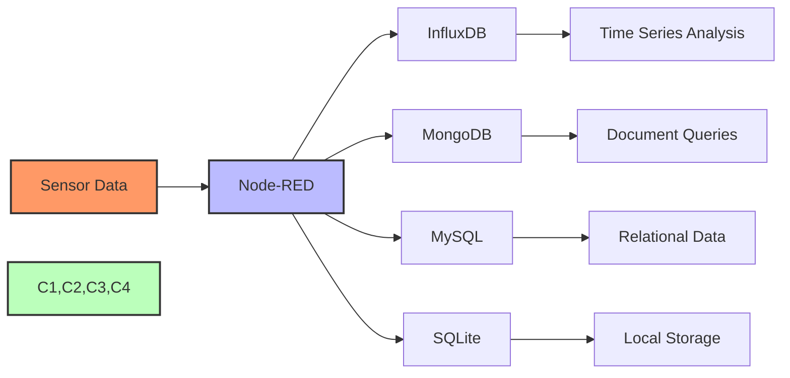

# Database Integration with Node-RED

Storing IoT data in databases allows for historical analysis, trend identification, and long-term data preservation.



## Database Types for IoT:
- **Time-Series DB**: InfluxDB, TimescaleDB (ideal for sensor data)
- **Document DB**: MongoDB (flexible schema)
- **Relational DB**: MySQL, PostgreSQL (structured data)
- **Cloud Options**: AWS DynamoDB, Azure Cosmos DB, Google BigQuery

[Search Node-RED database integration examples](https://www.google.com/search?q=node+red+database+integration+examples&tbm=isch)

## Presenter Notes (ข้อมูลสำหรับผู้บรรยาย)

> Key Takeaway: การเก็บข้อมูล IoT ในฐานข้อมูลที่เหมาะสมเป็นสิ่งสำคัญที่ช่วยให้สามารถวิเคราะห์ข้อมูลย้อนหลัง ค้นหาแนวโน้ม และนำข้อมูลไปใช้งานในระยะยาวได้

> วิธีการเชื่อมต่อฐานข้อมูลกับ Node-RED:
>
> 1. **ติดตั้งโหนดฐานข้อมูล** - ติดตั้งโหนดสำหรับฐานข้อมูลที่ต้องการใช้:
>    - `node-red-contrib-influxdb` สำหรับ InfluxDB
>    - `node-red-node-mysql` สำหรับ MySQL
>    - `node-red-node-mongodb` สำหรับ MongoDB
>    - `node-red-node-sqlite` สำหรับ SQLite
>
> 2. **การเลือกฐานข้อมูลที่เหมาะสม**:
>    - **InfluxDB**: เหมาะกับข้อมูลเซนเซอร์แบบ time-series เช่น อุณหภูมิ, ความชื้น
>    - **MongoDB**: เหมาะกับข้อมูลที่มีโครงสร้างยืดหยุ่นหรือไม่แน่นอน
>    - **MySQL/PostgreSQL**: เหมาะกับข้อมูลที่มีความสัมพันธ์ซับซ้อน
>    - **SQLite**: เหมาะกับการใช้งานเล็กๆ ที่ไม่ต้องการเซิร์ฟเวอร์แยก
>
> 3. **รูปแบบการจัดเก็บข้อมูล**:
>    ```javascript
>    // ตัวอย่างการปรับแต่งข้อมูลสำหรับ InfluxDB
>    msg.payload = [{
>        measurement: "room_sensors",
>        tags: {
>            location: "living_room",
>            device_id: msg.device_id
>        },
>        fields: {
>            temperature: msg.payload.temperature,
>            humidity: msg.payload.humidity
>        },
>        timestamp: new Date()
>    }];
>    return msg;
>    ```
>
> 4. **การดึงข้อมูล** - ใช้โหนด query เพื่อดึงข้อมูลจากฐานข้อมูลมาแสดงผล:
>    - การกำหนดช่วงเวลา
>    - การคัดกรองข้อมูลด้วยเงื่อนไข
>    - การรวมข้อมูล (aggregation)
>
> 5. **การบริหารจัดการข้อมูล**:
>    - การกำหนดนโยบายเก็บข้อมูล (retention policy)
>    - การบีบอัดข้อมูล (compression)
>    - การคำนวณข้อมูลล่วงหน้า (continuous queries)

> ศัพท์เทคนิค: Time-series database, Document database, Relational database, Query, Retention policy, Data aggregation, Schema, Measurement, Tag, Field, Timestamp
