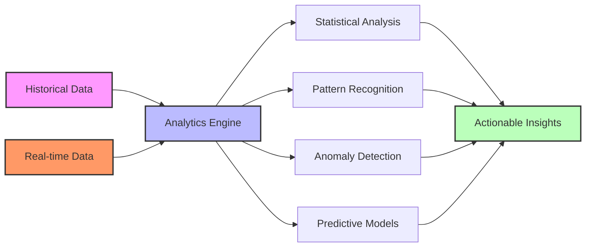

# Advanced Data Analytics in Node-RED

Node-RED can be extended with advanced analytics capabilities for data processing, machine learning, and predictive maintenance.



## Analytics Capabilities:
- Statistical functions (mean, median, variance)
- Trend analysis and forecasting
- Outlier and anomaly detection
- Machine learning integration
- Data visualization and reporting

[Search Node-RED analytics examples](https://www.google.com/search?q=node+red+data+analytics+machine+learning+examples&tbm=isch)

## Presenter Notes (ข้อมูลสำหรับผู้บรรยาย)

> Key Takeaway: Node-RED สามารถขยายความสามารถด้วยโหนดวิเคราะห์ขั้นสูง เพื่อประมวลผลข้อมูลอัจฉริยะ ตรวจจับรูปแบบ และคาดการณ์แนวโน้ม ทำให้ระบบ IoT มีความชาญฉลาดมากขึ้น

> เครื่องมือและเทคนิคการวิเคราะห์ข้อมูลขั้นสูงใน Node-RED:
>
> 1. **การวิเคราะห์ทางสถิติ** - ใช้โหนด Function หรือโหนดเฉพาะทางสำหรับการวิเคราะห์:
>    ```javascript
>    // คำนวณค่าเฉลี่ยเคลื่อนที่ (Moving Average)
>    var history = context.get('history') || [];
>    history.push(msg.payload);
>    
>    // เก็บข้อมูลล่าสุด 10 ค่า
>    if (history.length > 10) {
>        history.shift();
>    }
>    
>    // คำนวณค่าเฉลี่ย
>    var sum = history.reduce((a, b) => a + b, 0);
>    var avg = sum / history.length;
>    
>    context.set('history', history);
>    msg.payload = avg;
>    return msg;
>    ```
>
> 2. **การตรวจจับความผิดปกติ** - ติดตั้ง `node-red-contrib-machine-learning` หรือใช้ฟังก์ชัน:
>    - การตรวจจับด้วย Z-score
>    - การใช้ Interquartile Range (IQR)
>    - การตรวจจับการเปลี่ยนแปลงอย่างฉับพลัน
>
> 3. **การพยากรณ์แนวโน้ม**:
>    - Linear Regression ผ่าน `node-red-contrib-regression`
>    - การใช้ Simple Exponential Smoothing
>    - การใช้บริการ ML แบบคลาวด์ผ่าน API
>
> 4. **การจัดกลุ่มข้อมูล** - ติดตั้ง `node-red-contrib-machine-learning` สำหรับการทำ Clustering:
>    - K-Means Clustering
>    - Hierarchical Clustering
>
> 5. **การเชื่อมต่อกับบริการ AI ภายนอก**:
>    - TensorFlow.js ผ่าน `node-red-contrib-tensorflow`
>    - Google Cloud ML ผ่าน API
>    - AWS SageMaker ผ่าน API
>    - Azure ML ผ่าน API
>
> 6. **การรายงานผล** - สร้างรายงานอัตโนมัติโดยใช้:
>    - การส่งออกเป็น CSV หรือ Excel
>    - การสร้าง PDF จาก Template
>    - การส่งรายงานตามกำหนดเวลา

> การใช้งาน Node-RED Context เพื่อเก็บข้อมูลสำหรับวิเคราะห์ มีให้เลือก 3 รูปแบบ:
> - **Memory**: เร็วแต่หายเมื่อรีสตาร์ท
> - **File**: เก็บถาวรแต่ช้ากว่า
> - **Redis**: เร็วและเก็บถาวร แต่ต้องติดตั้งเพิ่ม

> ศัพท์เทคนิค: Data analytics, Statistical analysis, Machine learning, Anomaly detection, Moving average, Standard deviation, Z-score, Regression, Clustering, Predictive maintenance, Time series forecasting
