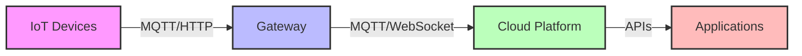

# IoT Device Connection Overview

Connecting IoT devices involves bridging physical hardware with network protocols to enable seamless data collection and control.

**Key Connection Methods:**
- Direct Internet Connection (WiFi/Cellular)
- Gateway-mediated Connection
- Mesh Network Connection
- Low-Power Wide Area Networks (LPWAN)

[Search IoT device connection diagrams](https://www.google.com/search?q=IoT+device+connection+architecture+diagram&tbm=isch)

## Presenter Notes (ข้อมูลสำหรับผู้บรรยาย)

> Key Takeaway: การเชื่อมต่ออุปกรณ์ IoT เป็นการเชื่อมโลกกายภาพกับโลกดิจิทัลผ่านโปรโตคอลการสื่อสารต่างๆ โดยมีวิธีการหลักๆ ได้แก่ การเชื่อมต่อโดยตรงผ่านอินเทอร์เน็ต (WiFi/Cellular), การเชื่อมต่อผ่าน Gateway, การเชื่อมต่อแบบ Mesh Network และการเชื่อมต่อแบบ LPWAN สำหรับพื้นที่กว้าง แต่ละวิธีมีข้อดีข้อเสียแตกต่างกันขึ้นอยู่กับระยะทาง การใช้พลังงาน และความต้องการในการรับส่งข้อมูล

> เน้นให้ผู้เรียนเข้าใจว่าแต่ละรูปแบบการเชื่อมต่อมีความเหมาะสมกับสถานการณ์การใช้งานที่แตกต่างกัน เช่น WiFi เหมาะกับการใช้งานในอาคารที่มีการรับส่งข้อมูลมาก ในขณะที่ LPWAN เช่น LoRaWAN เหมาะกับการใช้งานภายนอกอาคารที่ไกลแต่ข้อมูลน้อย

> ศัพท์เทคนิค: Device connectivity, Gateway, Direct connection, Mesh network, LPWAN, Protocol, Topology, Network architecture
