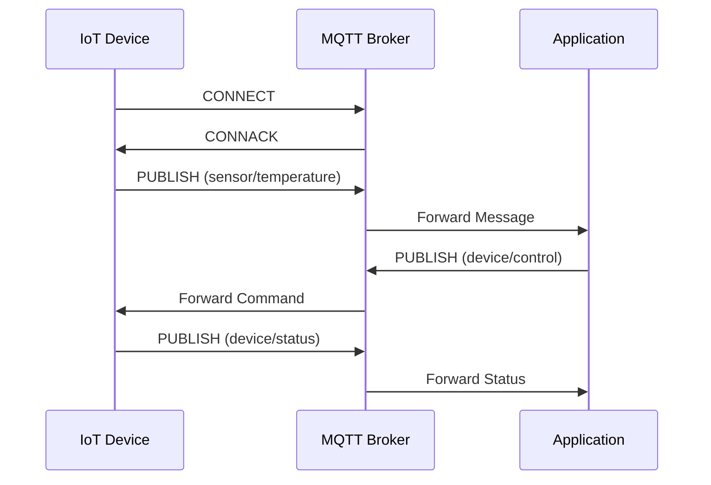

# MQTT Device Communication

MQTT is the leading protocol for IoT device communication due to its lightweight nature and efficient publish-subscribe model.

**Key MQTT Features for Devices:**
- QoS Levels (0, 1, 2)
- Last Will and Testament
- Retained Messages
- Clean/Persistent Sessions
- Topic Wildcards

[Search MQTT protocol diagram](https://www.google.com/search?q=MQTT+protocol+device+communication+diagram&tbm=isch)

## Presenter Notes (ข้อมูลสำหรับผู้บรรยาย)

> Key Takeaway: MQTT เป็นโปรโตคอลที่ได้รับความนิยมสูงสุดในการเชื่อมต่ออุปกรณ์ IoT เนื่องจากมีขนาดเล็ก ใช้ทรัพยากรและแบนด์วิธน้อย และมีรูปแบบการสื่อสารแบบ publish-subscribe ที่เหมาะกับระบบ IoT อย่างยิ่ง

> คุณสมบัติสำคัญของ MQTT ที่ควรเน้นได้แก่ QoS (Quality of Service) ที่มีให้เลือก 3 ระดับ, Last Will and Testament ที่ช่วยในการตรวจจับอุปกรณ์ที่หลุดการเชื่อมต่อ, Retained Messages ที่ช่วยให้ Client ที่เพิ่งเชื่อมต่อได้รับข้อมูลล่าสุด, Clean/Persistent Sessions สำหรับการจัดการเซสชัน และ Topic Wildcards สำหรับการจัดการการสมัครรับข้อมูลหลายหัวข้อพร้อมกัน

> ให้ตัวอย่างการใช้งาน MQTT เช่น การดึงข้อมูลจากเซ็นเซอร์อุณหภูมิ ความชื้น และส่งไปยัง Broker เพื่อให้แอปพลิเคชันหรือ dashboard นำไปแสดงผล และการส่งคำสั่งไปควบคุมอุปกรณ์ เช่น การสั่งเปิด-ปิดหลอดไฟ

> ศัพท์เทคนิค: MQTT, Broker, Publish-Subscribe, QoS (Quality of Service), Last Will and Testament (LWT), Retained Messages, Clean Session, Topic, Wildcard
