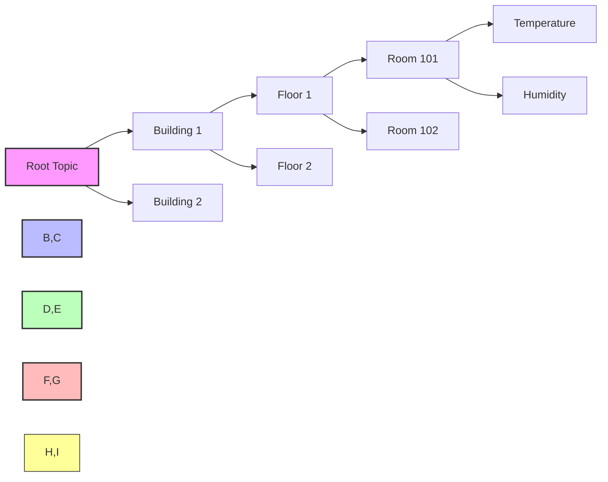

# Topic Hierarchy Design

Proper topic hierarchy design is crucial for organizing data flow and allowing easy filtering of messages through MQTT.

**Naming Conventions:**
- Use meaningful topic levels
- Establish standard prefixes (sensors/, devices/)
- Include device identifiers
- Separate commands and data topics
- Use multi-level wildcards (+, #)

[Search MQTT topic hierarchy examples](https://www.google.com/search?q=MQTT+topic+hierarchy+design+examples&tbm=isch)

## Presenter Notes (ข้อมูลสำหรับผู้บรรยาย)

> Key Takeaway: การออกแบบลำดับชั้นของ Topic ใน MQTT มีความสำคัญอย่างมากต่อการจัดระเบียบการไหลของข้อมูลและการจัดการอุปกรณ์จำนวนมาก การออกแบบที่ดีจะช่วยให้การกรองข้อมูล การค้นหา และการขยายระบบในอนาคตทำได้อย่างมีประสิทธิภาพ

> แนะนำหลักการตั้งชื่อ Topic ที่ดี เช่น:
> - ใช้ชื่อที่มีความหมายชัดเจน (เช่น sensors/temperature แทน s/t)
> - กำหนดรูปแบบมาตรฐานสำหรับ prefix (เช่น sensors/, devices/, commands/)
> - รวม ID ของอุปกรณ์ไว้ใน topic (เช่น devices/thermometer1/temperature)
> - แยก topic สำหรับคำสั่งและข้อมูล (เช่น devices/light1/command และ devices/light1/status)
> - ใช้ wildcard อย่างเหมาะสม (+ สำหรับหนึ่งระดับ, # สำหรับหลายระดับ)

> ตัวอย่างโครงสร้าง Topic ที่แนะนำ:
> 1. `[location]/[device-type]/[device-id]/[data-type]`
> 2. สำหรับการควบคุม: `cmnd/[device-id]/[command]`
> 3. สำหรับสถานะ: `stat/[device-id]/[status]`
> 4. สำหรับเซ็นเซอร์: `tele/[device-id]/[sensor]`

> ศัพท์เทคนิค: Topic hierarchy, Wildcards, Topic level, Topic filter, Topic pattern, Subscription, Topic tree, Namespace
