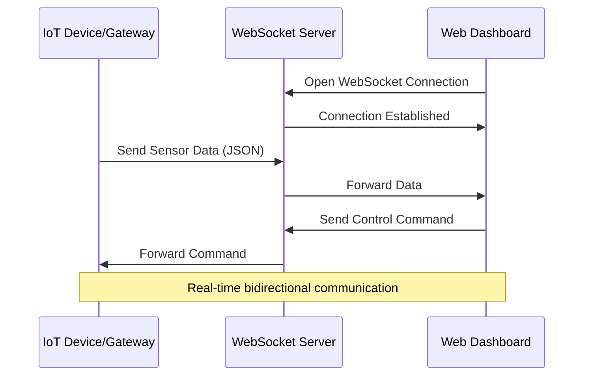

# WebSocket Device Integration

WebSockets enable bidirectional, real-time communication between IoT devices and web interfaces, providing low-latency data exchange.

**Key WebSocket Benefits:**
- Persistent connection with low overhead
- Real-time data without polling
- Bidirectional communication
- Native browser support
- Works through firewalls (port 80/443)

[Search WebSocket IoT implementation](https://www.google.com/search?q=WebSocket+IoT+device+integration+dashboard&tbm=isch)

## Presenter Notes (ข้อมูลสำหรับผู้บรรยาย)

> Key Takeaway: WebSocket เป็นโปรโตคอลที่เหมาะสมสำหรับการเชื่อมต่อระหว่างอุปกรณ์ IoT กับส่วนติดต่อผู้ใช้บนเว็บ หรือแอปพลิเคชันที่ต้องการข้อมูลแบบเรียลไทม์ โดย WebSocket จะสร้างการเชื่อมต่อถาวรระหว่างไคลเอนต์และเซิร์ฟเวอร์ ทำให้ข้อมูลสามารถส่งได้ทั้งสองทิศทางโดยไม่ต้องเปิดการเชื่อมต่อใหม่

> WebSocket แตกต่างจาก HTTP ตรงที่เมื่อเชื่อมต่อแล้ว จะสามารถส่งข้อมูลได้ตลอดเวลาโดยไม่ต้องรอการร้องขอ (request) ทำให้ประหยัดแบนด์วิธและมี latency ต่ำกว่า HTTP polling มาก

> การใช้งาน WebSocket กับอุปกรณ์ IoT มักผ่าน gateway หรือ bridge เพื่อแปลงจากโปรโตคอลที่ใช้ในระดับอุปกรณ์ (เช่น MQTT) มาเป็น WebSocket สำหรับการแสดงผลบนเว็บ Node-RED เป็นเครื่องมือที่นิยมใช้ทำหน้าที่นี้ได้อย่างดี

> กรณีใช้งานที่เหมาะสม:
> - แดชบอร์ดแสดงข้อมูลเรียลไทม์
> - ระบบควบคุมที่ต้องการการตอบสนองอย่างรวดเร็ว
> - แอปพลิเคชันที่มีการอัปเดตข้อมูลบ่อย

> ศัพท์เทคนิค: WebSocket, Full-duplex communication, Persistent connection, Real-time data transfer, WebSocket handshake, WebSocket frame, WebSocket API
