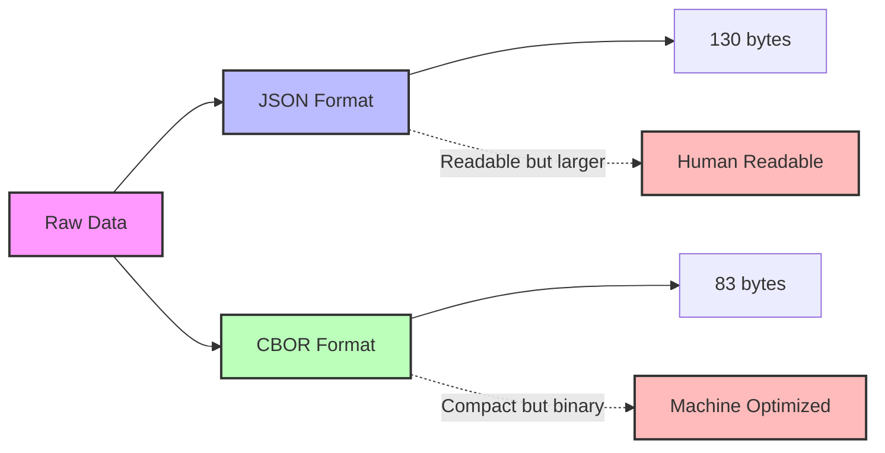

# Data Formats: JSON vs CBOR

Choosing the right data format for IoT communication affects bandwidth usage, parsing efficiency, and battery life.

**Comparison:**

| Feature | JSON | CBOR |
|---------|------|------|
| Size | Larger | Compact |
| Readability | Human-readable | Binary |
| Parsing | Medium | Efficient |
| Ecosystem | Widespread | Growing |
| Energy | Higher | Lower |

[Search IoT data format comparison](https://www.google.com/search?q=JSON+vs+CBOR+IoT+data+format+comparison&tbm=isch)

## Presenter Notes (ข้อมูลสำหรับผู้บรรยาย)

> Key Takeaway: การเลือกรูปแบบข้อมูล (Data Format) ที่เหมาะสมมีผลโดยตรงต่อประสิทธิภาพของระบบ IoT โดยเฉพาะในแง่ของการใช้แบนด์วิธ, การใช้พลังงาน และความเร็วในการประมวลผล

> JSON (JavaScript Object Notation) เป็นรูปแบบที่ได้รับความนิยมสูงเนื่องจากอ่านง่าย, สามารถแก้ไขด้วยมนุษย์ได้ และมีการรองรับในทุกภาษาโปรแกรมมิ่ง แต่ JSON มีขนาดใหญ่กว่าเมื่อเทียบกับรูปแบบ binary

> CBOR (Concise Binary Object Representation) เป็นรูปแบบ binary ที่ออกแบบมาเพื่อใช้ในสภาพแวดล้อมที่มีทรัพยากรจำกัด มีขนาดเล็กกว่า JSON ประมาณ 30-40% ทำให้ประหยัดแบนด์วิธและพลังงาน เหมาะสำหรับอุปกรณ์ที่ใช้แบตเตอรี่หรือมีข้อจำกัดด้านการสื่อสาร

> ในการเลือกใช้ควรพิจารณาจาก:
> - ข้อจำกัดของอุปกรณ์ (หน่วยความจำ, พลังงาน)
> - ปริมาณข้อมูลที่ต้องส่ง
> - ความต้องการในการ debug หรือตรวจสอบข้อมูล
> - ความเข้ากันได้กับระบบอื่นๆ

> กรณีทั่วไป: ใช้ JSON สำหรับการพัฒนาและทดสอบ และพิจารณาใช้ CBOR เมื่อต้องการเพิ่มประสิทธิภาพในระบบจริง

> ศัพท์เทคนิค: JSON (JavaScript Object Notation), CBOR (Concise Binary Object Representation), Data serialization, Binary format, Encoding, Bandwidth optimization, Parsing efficiency
