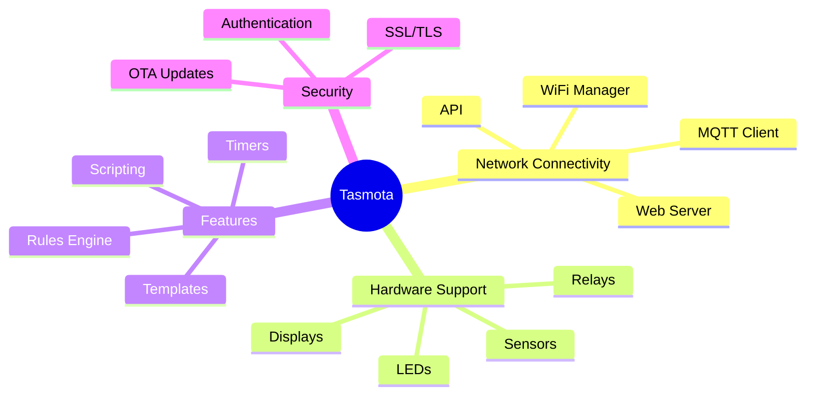

# Tasmota Firmware Introduction

Tasmota is a popular open-source firmware for ESP8266/ESP32 devices that provides MQTT support, web UI, and extensive device compatibility.

**Key Benefits:**
- No coding required for basic use
- OTA updates via web interface
- Supports 500+ devices via templates
- Extensive command API
- Active community support

[Search Tasmota firmware examples](https://www.google.com/search?q=Tasmota+firmware+ESP8266+smart+home&tbm=isch)

## Presenter Notes (ข้อมูลสำหรับผู้บรรยาย)

> Key Takeaway: Tasmota เป็นเฟิร์มแวร์โอเพนซอร์สที่ได้รับความนิยมสูงสำหรับอุปกรณ์ที่ใช้ชิป ESP8266/ESP32 ช่วยให้สามารถใช้งานอุปกรณ์ IoT ได้โดยไม่ต้องเขียนโค้ด มี UI ในตัว รองรับ MQTT และมีฟีเจอร์หลากหลาย

> จุดเด่นของ Tasmota คือ:
> - รองรับอุปกรณ์มากกว่า 500 รุ่นผ่านระบบ Templates
> - มีเว็บอินเตอร์เฟซในตัวสำหรับควบคุมและตั้งค่า
> - รองรับการอัปเดต Over-the-Air (OTA) ผ่านเว็บ
> - รองรับ MQTT และมีโครงสร้าง Topic ที่เป็นมาตรฐาน
> - มีระบบ Rules Engine สำหรับสร้างเงื่อนไขอัตโนมัติโดยไม่ต้องเขียนโค้ด
> - ชุมชนผู้ใช้งานขนาดใหญ่และมีการพัฒนาต่อเนื่อง

> Tasmota เหมาะสำหรับผู้เริ่มต้นที่ต้องการศึกษาการใช้งาน IoT หรือสร้างระบบบ้านอัจฉริยะ เพราะลดความซับซ้อนในการเขียนโค้ดและการตั้งค่า เป็นตัวอย่างที่ดีของการใช้ MQTT ในระบบจริง และสามารถเรียนรู้หลักการทำงานของระบบ IoT ได้จากการใช้งาน

> การติดตั้ง Tasmota สามารถทำได้หลายวิธี เช่น ผ่าน Tasmotizer, Web Installer หรือโดย การใช้ esptool โดยตรง

> ศัพท์เทคนิค: Tasmota, Firmware, ESP8266, ESP32, OTA (Over-the-Air) updates, Templates, Rules Engine, Web UI, GPIO mapping, Flash memory
