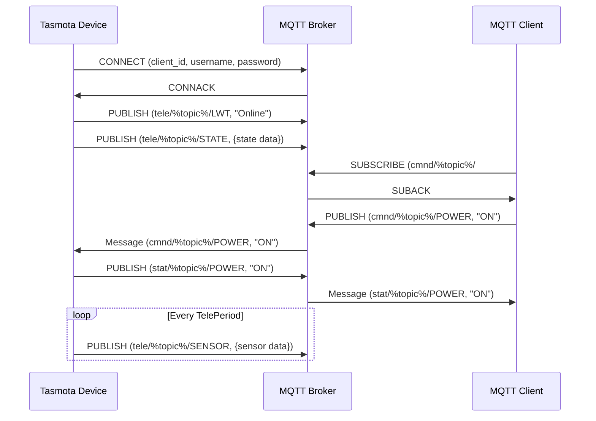

# Tasmota MQTT Integration

Tasmota uses a structured MQTT topic hierarchy for device control, status reporting, and telemetry data.

**Topic Structure:**
- **cmnd/%topic%/command** - Send commands to device
- **stat/%topic%/attribute** - Status updates (response to commands)
- **tele/%topic%/attribute** - Telemetry data (periodic updates)

[Search Tasmota MQTT examples](https://www.google.com/search?q=Tasmota+MQTT+topic+structure+examples&tbm=isch)

## Presenter Notes (ข้อมูลสำหรับผู้บรรยาย)

> Key Takeaway: Tasmota ใช้โครงสร้าง MQTT Topic ที่เป็นมาตรฐาน แบ่งเป็น 3 ประเภทหลัก ได้แก่ cmnd (คำสั่ง), stat (สถานะ) และ tele (ข้อมูลเซ็นเซอร์) ช่วยให้การจัดการอุปกรณ์จำนวนมากเป็นไปได้อย่างมีระบบ

> โครงสร้าง Topic ของ Tasmota:
> 1. **cmnd/%prefix%/%topic%/command** - ใช้สำหรับส่งคำสั่งไปยังอุปกรณ์ 
>    - เช่น `cmnd/light1/POWER` ค่าที่ส่งได้คือ "ON", "OFF", "TOGGLE"
>    - เช่น `cmnd/light1/COLOR` ส่งค่าสีในรูปแบบต่างๆ
> 
> 2. **stat/%prefix%/%topic%/attribute** - ใช้สำหรับข้อมูลสถานะที่เป็นผลจากคำสั่ง
>    - เช่น `stat/light1/POWER` แสดงสถานะ "ON" หรือ "OFF"
>    - เช่น `stat/light1/RESULT` แสดงผลลัพธ์ของคำสั่งในรูปแบบ JSON
> 
> 3. **tele/%prefix%/%topic%/attribute** - ใช้สำหรับข้อมูลเซ็นเซอร์และการแจ้งเตือนตามช่วงเวลา
>    - เช่น `tele/sensor1/SENSOR` ส่งข้อมูลเซ็นเซอร์ในรูปแบบ JSON
>    - เช่น `tele/sensor1/STATE` ส่งข้อมูลสถานะทั่วไปของอุปกรณ์
>    - เช่น `tele/sensor1/LWT` ส่งสถานะการเชื่อมต่อ "Online" หรือ "Offline"

> Tasmota มีการรองรับ Last Will and Testament (LWT) ช่วยให้ทราบเมื่ออุปกรณ์หลุดการเชื่อมต่อ และมีการส่งข้อมูลตามช่วงเวลาที่กำหนด (TelePeriod) ซึ่งสามารถปรับได้ตามความต้องการ

> ตัวอย่างคำสั่งพื้นฐานที่ใช้บ่อย:
> - POWER - ควบคุมการเปิด/ปิด
> - STATUS - ขอข้อมูลสถานะ
> - RESTART - รีสตาร์ทอุปกรณ์
> - UPGRADE - อัปเกรดเฟิร์มแวร์
> - BACKLOG - ส่งหลายคำสั่งพร้อมกัน

> ศัพท์เทคนิค: MQTT topic structure, Command topic (cmnd), Status topic (stat), Telemetry topic (tele), LWT (Last Will and Testament), TelePeriod, FullTopic, Topic prefix
