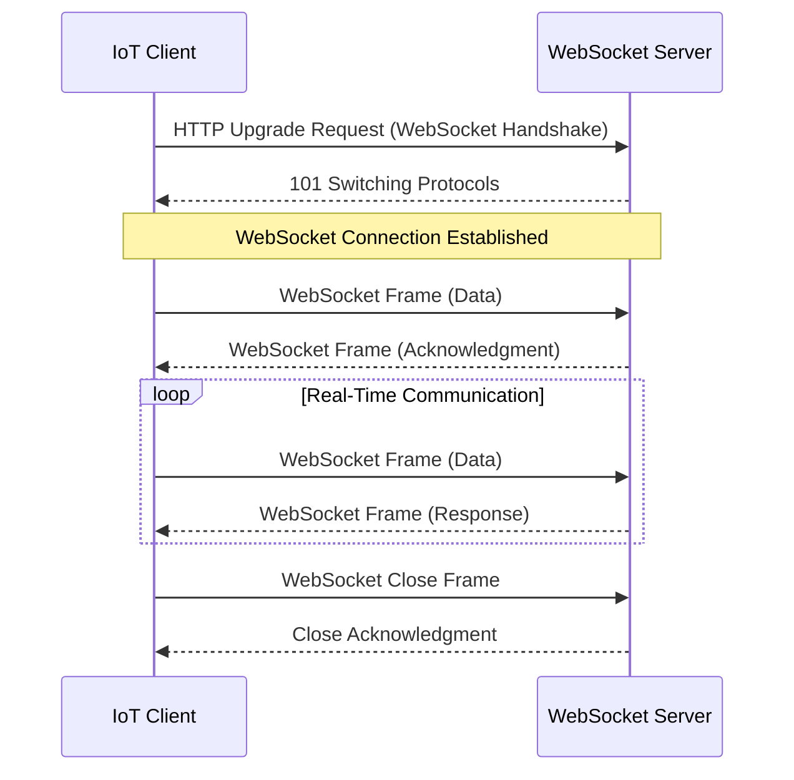

# WebSocket Communication Principles

WebSocket provides a persistent, full-duplex communication channel between client and server over a single TCP connection.

**Benefits over HTTP polling:**
- Up to 500x more efficient for real-time data
- Significantly reduced latency
- Lower overhead (no HTTP headers per message)
- True bidirectional communication

[Search WebSocket vs HTTP polling performance](https://www.google.com/search?q=WebSocket+vs+HTTP+polling+performance+comparison)

## Presenter Notes (ข้อมูลสำหรับผู้บรรยาย)

> Key Takeaway: WebSocket แตกต่างจาก HTTP polling ตรงที่สร้างการเชื่อมต่อเพียงครั้งเดียวแล้วสามารถส่งข้อมูลได้ทั้งสองทิศทางตลอดเวลา ทำให้มีประสิทธิภาพสูงกว่ามากในการส่งข้อมูลแบบเรียลไทม์ โดย WebSocket จะเริ่มต้นด้วย HTTP Handshake ปกติ แต่จะขอ "upgrade" การเชื่อมต่อเป็น WebSocket จากนั้นจะเปลี่ยนโปรโตคอลจาก HTTP เป็น WebSocket (ws:// หรือ wss://) ทำให้สามารถส่งข้อมูลได้โดยมี overhead ต่ำกว่ามาก

> โดยปกติ WebSocket เหมาะกับงานที่ต้องการ real-time updates หรือ bidirectional communication เช่น แชท, แดชบอร์ดแสดงข้อมูลเรียลไทม์, เกมส์ออนไลน์ หรือระบบแจ้งเตือน โดยลด latency และ server load เมื่อเทียบกับ polling

> ในบริบทของ IoT WebSocket เหมาะกับสถานการณ์ที่ต้องการ real-time monitoring หรือ remote control ที่ต้องการความรวดเร็วในการตอบสนอง

> ศัพท์เทคนิค: WebSocket handshake, WebSocket frame, Full-duplex communication, Persistent connection, Overhead, Latency, HTTP polling
