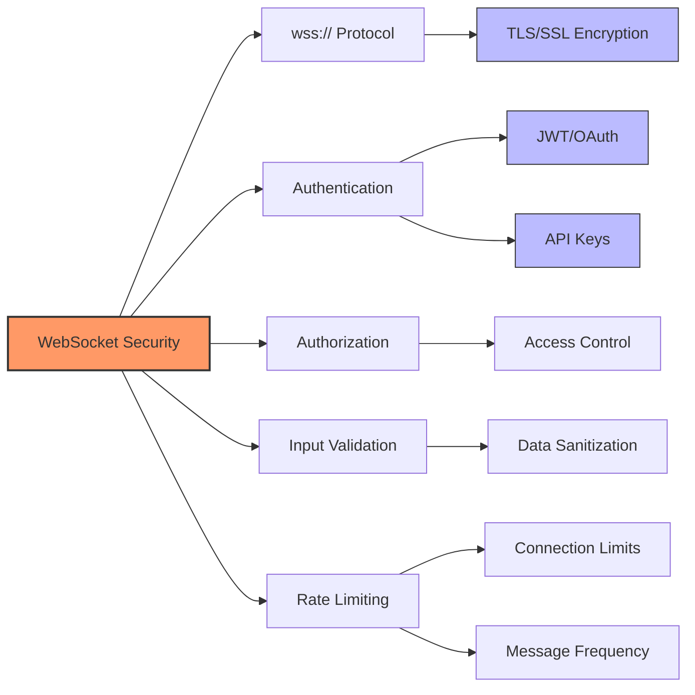

# WebSocket Security Considerations

WebSocket connections require proper security measures to protect IoT data transmission.

**Key Security Practices:**
- Always use wss:// (WebSocket Secure) instead of ws://
- Implement proper authentication & session management
- Validate and sanitize all incoming messages
- Apply rate limiting to prevent DoS attacks
- Implement message size restrictions
- Configure proper CORS policies

[Search WebSocket security best practices for IoT](https://www.google.com/search?q=WebSocket+security+best+practices+for+IoT+devices)

## Presenter Notes (ข้อมูลสำหรับผู้บรรยาย)

> Key Takeaway: การรักษาความปลอดภัยสำหรับ WebSocket มีความสำคัญมากเนื่องจากเป็นการเชื่อมต่อที่คงอยู่เป็นเวลานาน (long-lived connection) ซึ่งอาจเป็นเป้าหมายของการโจมตี ต้องใช้ WSS (WebSocket Secure) เสมอซึ่งเทียบเท่ากับ HTTPS สำหรับ WebSocket เพื่อเข้ารหัสการสื่อสาร

> การตรวจสอบตัวตน (Authentication) เป็นสิ่งสำคัญมาก โดยวิธีที่นิยมคือใช้ JWT (JSON Web Token) ในการ handshake หรือเมสเสจแรก โดยเซิร์ฟเวอร์ต้องตรวจสอบโทเค็นทุกครั้งที่มีการเชื่อมต่อใหม่

> ต้องระวังการโจมตีแบบ DoS (Denial of Service) โดยตั้งค่า rate limiting เพื่อจำกัดจำนวนการเชื่อมต่อและความถี่ของข้อความจากไคลเอนต์แต่ละราย และควรมีการจำกัดขนาดของข้อความด้วย

> ในบริบทของ IoT ควรพิจารณาเรื่องทรัพยากรที่จำกัดของอุปกรณ์ด้วย การรักษาการเชื่อมต่อ WebSocket อาจใช้พลังงานมากกว่าการเชื่อมต่อแบบไม่ต่อเนื่อง จึงควรพิจารณาการใช้ WebSocket ping/pong เพื่อตรวจสอบการเชื่อมต่อและกลไก reconnection ที่เหมาะสม

> ศัพท์เทคนิค: WebSocket Secure (WSS), TLS/SSL, Authentication, JSON Web Token (JWT), Rate limiting, Cross-Origin Resource Sharing (CORS), Denial of Service (DoS), Ping/Pong frames
