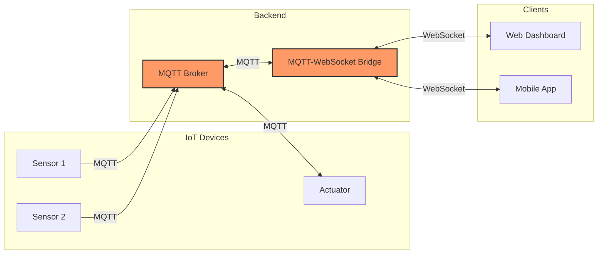

# MQTT-WebSocket Bridge Architecture

Bridging MQTT and WebSocket creates a seamless communication path between IoT devices and web interfaces.

**Benefits of MQTT-WebSocket Bridge:**
- Connect lightweight IoT protocols with web technologies
- Enable real-time dashboards with direct device communication
- Maintain security boundaries between networks
- Scale efficiently with message broker architecture
- Support browser-based control systems

[Search MQTT WebSocket bridge implementations](https://www.google.com/search?q=MQTT+WebSocket+bridge+implementation+examples+IoT)

## Presenter Notes (ข้อมูลสำหรับผู้บรรยาย)

> Key Takeaway: การสร้าง bridge ระหว่าง MQTT และ WebSocket เป็นการผสานจุดแข็งของโปรโตคอลทั้งสอง โดย MQTT เหมาะกับการสื่อสารระหว่างอุปกรณ์ IoT ที่มีข้อจำกัดด้านพลังงานและแบนด์วิธ ขณะที่ WebSocket เหมาะกับการสื่อสารเรียลไทม์กับเว็บไคลเอนต์และแอปพลิเคชันมือถือ

> สถาปัตยกรรมนี้มักประกอบด้วย 3 ส่วนหลัก: 1) MQTT Broker สำหรับการรับส่งข้อมูลระหว่างอุปกรณ์, 2) Bridge Service ที่แปลงข้อความระหว่าง MQTT และ WebSocket, และ 3) WebSocket Server ที่สื่อสารกับไคลเอนต์

> การทำงานหลักๆ คือเมื่อมีข้อมูลใหม่จากเซ็นเซอร์ส่งมาที่ MQTT broker, bridge จะรับข้อมูลผ่าน subscription และส่งต่อไปยังไคลเอนต์ผ่าน WebSocket ในทางกลับกัน เมื่อมีคำสั่งควบคุมจากไคลเอนต์ผ่าน WebSocket, bridge จะแปลงและส่งไปยัง MQTT topic ที่อุปกรณ์ปลายทางกำลัง subscribe อยู่

> Bridge นี้สามารถพัฒนาได้หลายวิธี เช่น ใช้ Node-RED ซึ่งมีโหนดสำเร็จรูปสำหรับทั้ง MQTT และ WebSocket, ใช้ MQTT broker ที่มี WebSocket support ในตัว เช่น Mosquitto, EMQX, หรือเขียนโปรแกรมเพื่อทำหน้าที่นี้โดยเฉพาะด้วย Node.js หรือภาษาอื่นๆ

> ศัพท์เทคนิค: MQTT-WebSocket bridge, Protocol translation, Message broker, Publish-subscribe pattern, Connection pooling, Bidirectional communication, Topic mapping, Payload transformation
