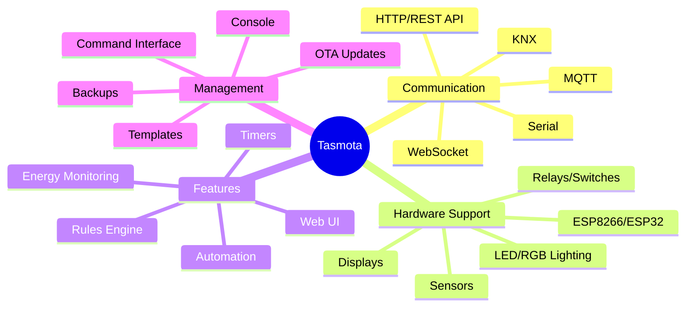

# Tasmota Firmware Overview

Tasmota is an open-source firmware for ESP8266/ESP32-based devices that provides advanced connectivity and control features.

**Key Advantages:**
- Replaces proprietary firmware with open-source alternative
- Extensive device support (300+ devices)
- Local control without cloud dependency
- Built-in MQTT and web interface
- Active community development
- Regular security updates

[Search Tasmota compatible devices examples](https://www.google.com/search?q=Tasmota+compatible+devices+examples+projects)

## Presenter Notes (ข้อมูลสำหรับผู้บรรยาย)

> Key Takeaway: Tasmota เป็นเฟิร์มแวร์โอเพนซอร์สที่พัฒนาเพื่อทดแทนเฟิร์มแวร์ดั้งเดิมในอุปกรณ์ที่ใช้ชิป ESP8266/ESP8285 จากเดิมที่เริ่มพัฒนาสำหรับอุปกรณ์ Sonoff ปัจจุบันรองรับอุปกรณ์มากกว่า 300 รุ่น จากหลายผู้ผลิต

> จุดเด่นของ Tasmota คือการมีคุณสมบัติครบถ้วนสำหรับระบบบ้านอัจฉริยะและ IoT โดยไม่พึ่งพาระบบคลาวด์ สามารถใช้งานได้แบบ local control ผ่าน web interface ในตัว หรือผ่าน MQTT ทำให้เข้ากับระบบบ้านอัจฉริยะส่วนใหญ่ได้เป็นอย่างดี รวมถึง Home Assistant, OpenHAB, Node-RED และอื่นๆ

> Tasmota มาพร้อมกับฟีเจอร์สำคัญหลายอย่าง เช่น OTA updates (การอัปเดตเฟิร์มแวร์แบบไร้สาย), Rules Engine (ระบบตั้งกฎที่ทำงานบนอุปกรณ์โดยไม่ต้องพึ่งคอนโทรลเลอร์ภายนอก), Template System (ระบบที่ช่วยให้รองรับอุปกรณ์ใหม่ๆ ได้ง่าย), และฟีเจอร์ประหยัดพลังงานสำหรับอุปกรณ์ที่ทำงานบนแบตเตอรี่

> โดยในด้านความปลอดภัย Tasmota มีการออกแบบที่ดีกว่าเฟิร์มแวร์ดั้งเดิมของหลายอุปกรณ์ ไม่ต้องพึ่งพาการเชื่อมต่ออินเทอร์เน็ตหรือคลาวด์ภายนอกซึ่งอาจเป็นความเสี่ยงด้านความปลอดภัยและความเป็นส่วนตัว

> ศัพท์เทคนิค: Firmware, ESP8266, ESP8285, ESP32, Over-the-Air (OTA) updates, MQTT integration, Rules Engine, Template System, Web UI, Local Control, Flash memory
