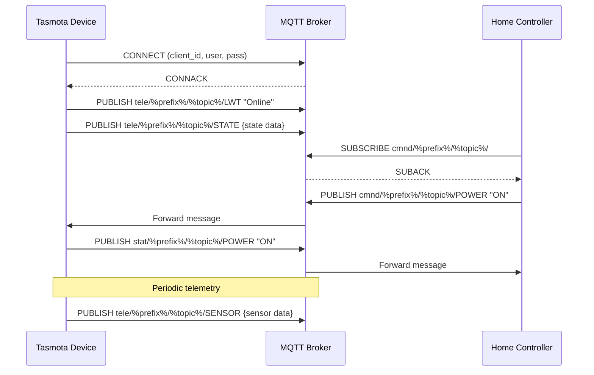

# Tasmota MQTT Integration

Tasmota uses a structured MQTT topic hierarchy for device communication and control.

**Topic Structure:**
- `cmnd/%prefix%/%topic%/`: Commands to the device
- `stat/%prefix%/%topic%/`: Status information (response to commands)
- `tele/%prefix%/%topic%/`: Telemetry data sent periodically

[Search Tasmota MQTT command examples](https://www.google.com/search?q=Tasmota+MQTT+command+examples+cheatsheet)

## Presenter Notes (ข้อมูลสำหรับผู้บรรยาย)

> Key Takeaway: Tasmota ใช้โครงสร้าง MQTT topic ที่เป็นระบบ แบ่งเป็น 3 กลุ่มหลักตามวัตถุประสงค์การใช้งาน ได้แก่ cmnd (command) สำหรับส่งคำสั่งไปยังอุปกรณ์, stat (status) สำหรับส่งข้อมูลสถานะกลับเมื่อมีการเปลี่ยนแปลง และ tele (telemetry) สำหรับข้อมูลที่ส่งตามรอบเวลา

> รูปแบบ topic จะอยู่ในรูปแบบ `prefix/topic/command` โดย prefix คือค่าที่กำหนดในการตั้งค่า (เช่น cmnd, stat, tele), topic คือชื่อของอุปกรณ์ และ command คือคำสั่งหรือประเภทข้อมูล เช่น POWER, STATE, SENSOR เป็นต้น

> ตัวอย่างการใช้งาน MQTT ใน Tasmota:
> - การสั่งเปิดอุปกรณ์: ส่งข้อความ "ON" ไปที่ topic `cmnd/mydevice/POWER`
> - อุปกรณ์จะตอบกลับสถานะที่ topic `stat/mydevice/POWER` ด้วยข้อความ "ON" 
> - ข้อมูลเซ็นเซอร์จะถูกส่งตามรอบเวลาไปที่ topic `tele/mydevice/SENSOR` ในรูปแบบ JSON
> - อุปกรณ์จะส่งสถานะ "Online" หรือ "Offline" ที่ topic `tele/mydevice/LWT` (Last Will and Testament)

> ฟีเจอร์สำคัญคือ full state retention โดยเมื่อมีการเชื่อมต่อกับ MQTT broker ที่เปิดใช้งาน retain message อุปกรณ์ Tasmota จะสามารถกลับมาอยู่ในสถานะล่าสุดก่อนการตัดการเชื่อมต่อได้ ทำให้การทำงานต่อเนื่องแม้จะมีปัญหาการเชื่อมต่อชั่วคราว

> ศัพท์เทคนิค: MQTT Topic hierarchy, Command topic, Status topic, Telemetry topic, Last Will and Testament (LWT), Retained messages, JSON payload, QoS (Quality of Service), Client ID, Clean session
