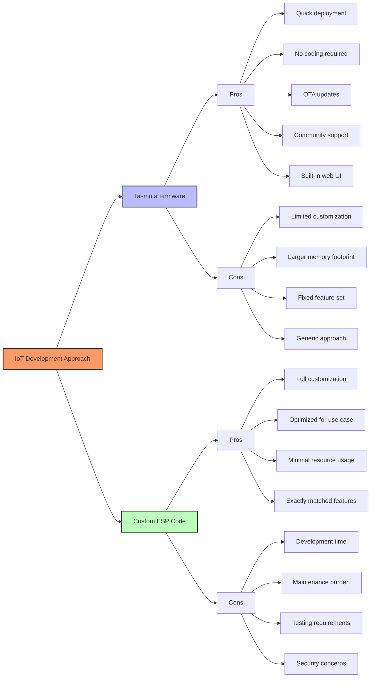

# Tasmota vs Custom ESP Code

Comparing pre-built firmware solutions with custom programming approaches for IoT devices.

**Selection Criteria:**
- Project timeline and urgency
- Required customization level
- Device hardware constraints
- Development expertise available
- Long-term maintenance plans
- Integration requirements

[Search ESP8266 custom firmware vs Tasmota comparison](https://www.google.com/search?q=ESP8266+custom+firmware+vs+Tasmota+comparison)

## Presenter Notes (ข้อมูลสำหรับผู้บรรยาย)

> Key Takeaway: การเลือกระหว่าง Tasmota กับการเขียนโค้ดเองขึ้นอยู่กับความต้องการและทรัพยากรที่มี Tasmota เหมาะกับการพัฒนาที่ต้องการความรวดเร็ว โครงการทั่วไปที่ไม่มีความต้องการพิเศษ ขณะที่การเขียนโค้ดเองเหมาะกับโครงการที่ต้องการฟีเจอร์เฉพาะทางหรือมีข้อจำกัดด้านฮาร์ดแวร์

> Tasmota มีข้อดีคือการติดตั้งง่าย แฟลชไฟล์เฟิร์มแวร์เพียงครั้งเดียว มีฟีเจอร์พื้นฐานพร้อมใช้งานทันที เช่น MQTT, web server, OTA updates ซึ่งหากเขียนเองต้องใช้เวลาพัฒนา และมีการอัปเดตความปลอดภัยสม่ำเสมอจากชุมชน แต่ข้อเสียคือความยืดหยุ่นที่น้อยกว่า ขนาดไฟล์ใหญ่กว่าซึ่งอาจไม่เหมาะกับอุปกรณ์ที่มีหน่วยความจำจำกัด และอาจมีฟีเจอร์หลายอย่างที่ไม่จำเป็นต้องใช้

> การเขียนโค้ดเองมีข้อดีคือปรับแต่งได้ตามต้องการ ใช้ทรัพยากรเฉพาะที่จำเป็น สามารถเพิ่มฟีเจอร์พิเศษเฉพาะทางได้ แต่ข้อเสียคือต้องใช้เวลาพัฒนามากกว่า ต้องออกแบบและทดสอบเอง ต้องจัดการด้านความปลอดภัยเอง และการอัปเดตเฟิร์มแวร์ทำได้ยากกว่า

> ในด้านการเรียนรู้ Tasmota เป็นกรณีศึกษาที่ดีสำหรับการพัฒนา IoT firmware ที่มีคุณภาพ แม้จะใช้งาน Tasmota โดยตรง การศึกษาโค้ดต้นฉบับและแนวทางการออกแบบก็มีประโยชน์มากสำหรับผู้พัฒนา IoT เนื่องจากแสดงให้เห็นวิธีการจัดการกับความท้าทายที่พบบ่อยในการพัฒนาอุปกรณ์ IoT

> ศัพท์เทคนิค: Firmware flashing, Custom firmware, Arduino framework, PlatformIO, Memory optimization, Feature modularity, ESP Arduino core, Hardware abstraction layer, SPIFFS (SPI Flash File System), Build optimization
