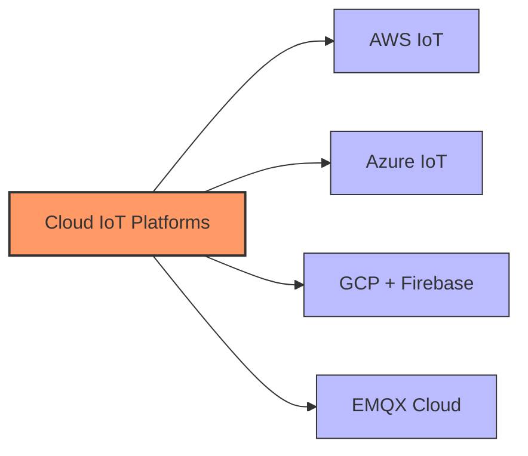

# Cloud Platforms for IoT

## Major Cloud IoT Providers

[Search for Cloud IoT Platforms Comparison](https://www.google.com/search?q=aws+azure+google+cloud+iot+comparison&tbm=isch)

## Presenter Notes (ข้อมูลสำหรับผู้บรรยาย)

> **Key Takeaway**: แต่ละแพลตฟอร์มคลาวด์มีจุดเด่นและข้อจำกัดแตกต่างกัน การเลือกใช้ขึ้นอยู่กับความต้องการเฉพาะของโครงการ ความเข้ากันได้กับระบบที่มีอยู่ และงบประมาณ

อธิบายความแตกต่างของแต่ละแพลตฟอร์ม:

**AWS IoT Core**:
- จุดเด่น: ระบบนิเวศที่ครบถ้วน, รองรับอุปกรณ์จำนวนมาก, ผสานรวมกับบริการอื่นๆ ของ AWS ได้ดี
- มีเครื่องมือจัดการ Device Shadow และ Device Registry ที่มีประสิทธิภาพ
- เหมาะสมกับ: องค์กรขนาดใหญ่ที่ต้องการความยืดหยุ่นสูง

**Azure IoT Hub**:
- จุดเด่น: รวมกับ Azure Digital Twins และ Time Series Insights
- เชื่อมต่อกับระบบ Microsoft อื่นๆ ได้ดี
- เหมาะสมกับ: องค์กรที่ใช้เทคโนโลยี Microsoft อยู่แล้ว

**Google Cloud (Firebase)**:
- จุดเด่น: Firebase Realtime Database ใช้งานง่าย, เชื่อมต่อเว็บและมือถือได้ดี
- เหมาะสมกับ: การพัฒนาแอปที่ต้องการ real-time และ startup

**EMQX Cloud**:
- จุดเด่น: เน้น MQTT โดยเฉพาะ, ค่าใช้จ่ายต่ำ, ใช้งานง่าย
- เหมาะสมกับ: โปรเจคที่ใช้ MQTT เป็นหลัก, มีงบจำกัด

ศัพท์เทคนิคที่สำคัญ: IoT Core, IoT Hub, Device Registry, Device Shadow, MQTT as a Service, Rule Engine
