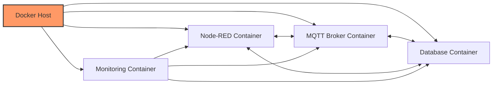

# Deploying IoT Services with Docker

## Containerized IoT Infrastructure

[Search for Docker IoT Architecture](https://www.google.com/search?q=docker+containers+iot+architecture&tbm=isch)

## Presenter Notes (ข้อมูลสำหรับผู้บรรยาย)

> **Key Takeaway**: การใช้ Docker ในการ deploy ระบบ IoT ช่วยให้การจัดการ infrastructure มีประสิทธิภาพมากขึ้น ลดความซับซ้อนในการติดตั้ง และทำให้ระบบสามารถ scale ได้ง่าย

อธิบายขั้นตอนการติดตั้งและประโยชน์ของการใช้ Docker:

**ขั้นตอนการติดตั้งบน Cloud VM**:
1. สร้าง VM บน cloud provider (AWS EC2, Google Compute Engine, Azure VM)
2. ติดตั้ง Docker และ Docker Compose
3. เตรียมไฟล์ `docker-compose.yml` ที่กำหนด services ต่างๆ
4. รัน `docker-compose up -d` เพื่อสร้างและเริ่มต้น containers

**ตัวอย่าง services ที่ควรมีใน docker-compose.yml**:
- Node-RED สำหรับสร้าง flows และ dashboard
- MQTT Broker เช่น Mosquitto หรือ EMQX
- ฐานข้อมูล เช่น InfluxDB สำหรับเก็บข้อมูล time series
- Grafana สำหรับแสดงผลข้อมูลแบบ visualization

**ประโยชน์ของ Docker**:
- ติดตั้งได้รวดเร็วและเหมือนกันในทุกสภาพแวดล้อม
- แยกแต่ละ service เป็นอิสระต่อกัน
- อัพเดตและ rollback ได้ง่าย
- ย้ายระบบระหว่าง cloud providers ได้สะดวก

ศัพท์เทคนิคที่สำคัญ: Containerization, Docker, Docker Compose, Microservices, Container Orchestration, Service Discovery
