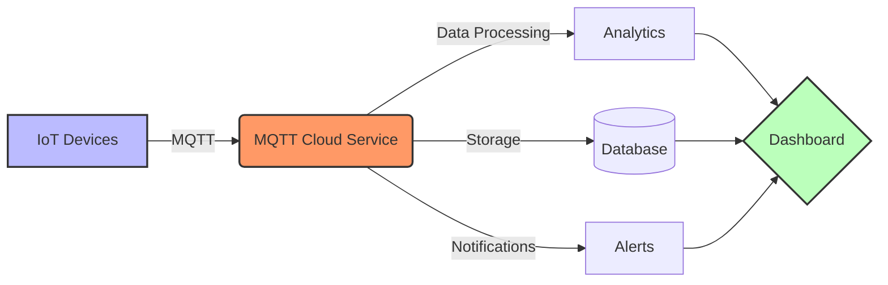

# MQTT Cloud Services

## Managed MQTT Broker Solutions

[Search for MQTT Cloud Architecture](https://www.google.com/search?q=mqtt+cloud+broker+architecture&tbm=isch)

## Presenter Notes (ข้อมูลสำหรับผู้บรรยาย)

> **Key Takeaway**: บริการ MQTT Cloud แบบ managed ช่วยลดภาระในการบริหารจัดการ infrastructure และมีคุณสมบัติด้านความปลอดภัย ความเสถียร และ scalability ที่เหนือกว่าการติดตั้งเอง

อธิบายทางเลือกของการใช้ MQTT Cloud Service:

**EMQX Cloud**:
- บริการ MQTT Broker แบบ managed จากผู้พัฒนา EMQX
- มี dashboard จัดการที่ใช้งานง่าย
- รองรับผู้ใช้และ rule engine ขั้นสูง
- มีแผนฟรีให้ทดลองใช้
- สามารถเลือก deploy บน AWS, Azure หรือ GCP ได้

**HiveMQ Cloud**:
- รองรับ MQTT 5.0 อย่างสมบูรณ์
- มีเครื่องมือ monitoring และการวิเคราะห์ที่ดี
- เน้นความปลอดภัยและการเชื่อมต่อกับระบบองค์กร
- มีทั้งแบบ shared และ dedicated cluster

**การเลือกใช้ MQTT Cloud**:
1. พิจารณาจำนวนการเชื่อมต่อและปริมาณข้อมูลที่ต้องการ
2. ความต้องการด้าน latency และพื้นที่ให้บริการทางภูมิศาสตร์
3. ฟีเจอร์ด้านความปลอดภัยเช่น TLS, authentication และ ACL
4. การผสานรวมกับบริการอื่นๆ
5. งบประมาณและแผนการขยายในอนาคต

บริการเหล่านี้มักคิดค่าบริการตามจำนวนการเชื่อมต่อ (connections) และจำนวนข้อความ (messages) ดังนั้นควรวางแผนการใช้งานให้เหมาะสม

ศัพท์เทคนิคที่สำคัญ: Managed MQTT Broker, MQTT as a Service, Connection Minutes, MQTT 5.0, Protocol Bridge, Shared Subscription
