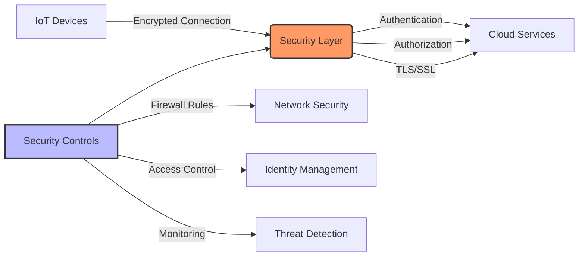

# Cloud IoT Security

## Securing Your Cloud IoT Infrastructure

[Search for IoT Cloud Security](https://www.google.com/search?q=cloud+iot+security+architecture&tbm=isch)

## Presenter Notes (ข้อมูลสำหรับผู้บรรยาย)

> **Key Takeaway**: ความปลอดภัยเป็นประเด็นสำคัญในระบบ IoT บนคลาวด์ การออกแบบที่ดีต้องมีการป้องกันในทุกระดับตั้งแต่อุปกรณ์ การสื่อสาร จนถึงการจัดเก็บข้อมูล

อธิบายมาตรการความปลอดภัยที่จำเป็นสำหรับ IoT บนคลาวด์:

**1. การรักษาความปลอดภัยการเชื่อมต่อ**:
- ใช้ TLS/SSL สำหรับทุกการเชื่อมต่อ MQTT (port 8883)
- ตั้งค่า certificates ให้ถูกต้อง ทั้ง CA, server และ client
- ใช้ MQTT over WebSocket Secure (WSS) สำหรับการเชื่อมต่อผ่านเว็บ

**2. การพิสูจน์ตัวตนและสิทธิ์**:
- กำหนด username/password ที่ซับซ้อนเพียงพอ
- ใช้ระบบ X.509 certificates สำหรับการพิสูจน์ตัวตนอุปกรณ์
- ตั้งค่า Access Control List (ACL) เพื่อควบคุมสิทธิ์ในการ publish และ subscribe

**3. การตั้งค่าบนคลาวด์**:
- จำกัด network access ด้วย security groups และ firewall rules
- เปิดเฉพาะ ports ที่จำเป็น (1883, 8883, 8084, 8083)
- แยก VPC/subnet สำหรับ IoT infrastructure

**4. การจัดการข้อมูล**:
- เข้ารหัสข้อมูลที่จัดเก็บ (encryption at rest)
- จำกัดการเข้าถึงข้อมูลด้วยสิทธิ์ที่เหมาะสม
- กำหนดนโยบายการเก็บข้อมูล (data retention policy)

**5. การตรวจสอบและเฝ้าระวัง**:
- เปิด logging สำหรับทุก services
- ตั้งค่าการแจ้งเตือนเมื่อมีการเข้าถึงผิดปกติ
- ตรวจสอบ logs อย่างสม่ำเสมอ

ศัพท์เทคนิคที่สำคัญ: TLS/SSL, X.509 Certificates, Access Control List (ACL), Security Groups, VPC (Virtual Private Cloud), Encryption at Rest, Authentication, Authorization
