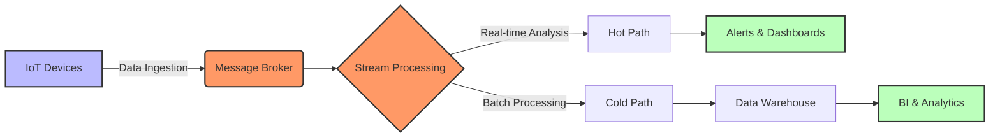

# IoT Cloud Architecture

## Reference Architecture for Cloud-Based IoT

[Search for IoT Cloud Architecture](https://www.google.com/search?q=iot+cloud+reference+architecture+diagram&tbm=isch)

## Presenter Notes (ข้อมูลสำหรับผู้บรรยาย)

> **Key Takeaway**: การออกแบบสถาปัตยกรรม IoT บนคลาวด์ที่ดีควรคำนึงถึงการรับข้อมูล (ingestion), การประมวลผล (processing) และการเก็บรักษาข้อมูล (storage) ที่มีประสิทธิภาพ

อธิบายองค์ประกอบหลักในสถาปัตยกรรม IoT บนคลาวด์:

**1. Data Ingestion Layer**:
- รับข้อมูลจากอุปกรณ์ IoT จำนวนมากพร้อมกัน
- ใช้ MQTT Broker เช่น EMQX หรือ AWS IoT Core
- รองรับโปรโตคอลต่างๆ (MQTT, HTTP, WebSocket)
- มี buffer รับข้อมูลเพื่อป้องกัน data loss

**2. Message Broker**:
- ทำหน้าที่เป็นตัวกลางในการส่งข้อมูล
- รองรับการทำ publish/subscribe
- จัดการคิวข้อความ (message queue)

**3. Stream Processing**:
- Hot Path: ประมวลผลข้อมูลแบบ real-time สำหรับการตอบสนองทันที
  - เช่น AWS Kinesis, Azure Stream Analytics
- Cold Path: ประมวลผลข้อมูลแบบ batch สำหรับการวิเคราะห์เชิงลึก
  - เช่น Hadoop, Spark

**4. Storage Layer**:
- Time-series database สำหรับข้อมูลเซนเซอร์ (InfluxDB, TimescaleDB)
- Object storage สำหรับข้อมูลดิบ (S3, Azure Blob)
- Data warehouse สำหรับข้อมูลที่ผ่านการประมวลผล

**5. Visualization & Analytics**:
- แดชบอร์ดแสดงข้อมูลแบบ real-time
- การวิเคราะห์ข้อมูลเชิงลึก
- ระบบแจ้งเตือนและการตั้งค่าเงื่อนไข

**คำแนะนำในการออกแบบ**:
- ออกแบบให้รองรับการขยายตัว (scalability)
- มีระบบสำรองและกู้คืนข้อมูล (redundancy)
- คำนึงถึงความหน่วง (latency) และค่าใช้จ่าย
- วางแผนการจัดการข้อมูลขนาดใหญ่

ศัพท์เทคนิคที่สำคัญ: Data Ingestion, Stream Processing, Hot Path, Cold Path, Time-Series Database, Data Lake, Data Warehouse, Message Broker, Scalability
