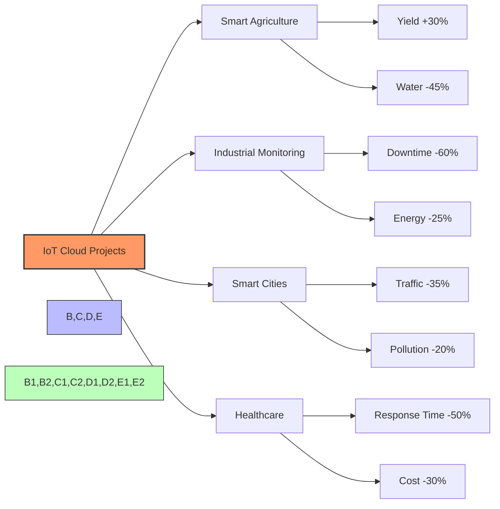

# IoT Cloud Success Stories

## Real-World Applications and Case Studies

[Search for IoT Cloud Case Studies](https://www.google.com/search?q=successful+iot+cloud+implementation+case+studies&tbm=isch)

## Presenter Notes (ข้อมูลสำหรับผู้บรรยาย)

> **Key Takeaway**: กรณีศึกษาจากโครงการจริงแสดงให้เห็นว่าการประยุกต์ใช้ IoT บนคลาวด์สามารถสร้างผลลัพธ์ที่วัดผลได้ชัดเจนในหลากหลายอุตสาหกรรม

นำเสนอกรณีศึกษาของการนำ IoT บนคลาวด์ไปใช้จริง:

**1. กรณีศึกษา: เกษตรอัจฉริยะในประเทศไทย**
- โครงการ: บริษัท XYZ Farming ใช้ EMQX Cloud + InfluxDB + Grafana
- ติดตั้งเซนเซอร์ความชื้นดิน อุณหภูมิ และความชื้นในอากาศกว่า 1,500 จุด
- ผลลัพธ์:
  - ลดการใช้น้ำลง 45%
  - เพิ่มผลผลิตขึ้น 30%
  - คืนทุนภายใน 14 เดือน
- ปัจจัยความสำเร็จ: การออกแบบที่ดี การเลือกเซนเซอร์ที่เหมาะสม และการวิเคราะห์ข้อมูลที่แม่นยำ

**2. กรณีศึกษา: โรงงานอุตสาหกรรม 4.0**
- โครงการ: บริษัท ABC Manufacturing ใช้ Azure IoT Hub + Time Series Insights
- ติดตั้งเซนเซอร์ตรวจวัดเครื่องจักรกว่า 500 จุด
- ผลลัพธ์:
  - ลดเวลาเครื่องจักรหยุดทำงาน (downtime) 60%
  - ลดการใช้พลังงาน 25%
  - ยืดอายุการใช้งานเครื่องจักร 40%
- ปัจจัยความสำเร็จ: การบำรุงรักษาเชิงพยากรณ์ (predictive maintenance) และการปรับปรุงกระบวนการผลิตตามผลการวิเคราะห์

**3. กรณีศึกษา: ระบบเมืองอัจฉริยะ**
- โครงการ: เทศบาลเมือง X ใช้ AWS IoT Core + Lambda + DynamoDB
- ติดตั้งเซนเซอร์ตรวจวัดคุณภาพอากาศ การจราจร และปริมาณขยะ
- ผลลัพธ์:
  - ลดเวลาติดขัดในการจราจร 35%
  - ลดมลพิษในอากาศ 20%
  - เพิ่มประสิทธิภาพการจัดเก็บขยะ 40%
- ปัจจัยความสำเร็จ: การวางแผนโครงสร้างพื้นฐานอย่างเป็นระบบและการมีส่วนร่วมของประชาชน

อธิบายว่าในแต่ละกรณีศึกษา การเลือกใช้คลาวด์ช่วยให้โครงการสามารถขยายขนาดได้ง่าย ลดต้นทุนในการบริหารจัดการ และเพิ่มความยืดหยุ่นในการพัฒนาต่อยอด

ศัพท์เทคนิคที่สำคัญ: ROI (Return on Investment), Predictive Maintenance, Real-time Analytics, Scalable Infrastructure, Digital Transformation, Smart Agriculture, Industry 4.0
