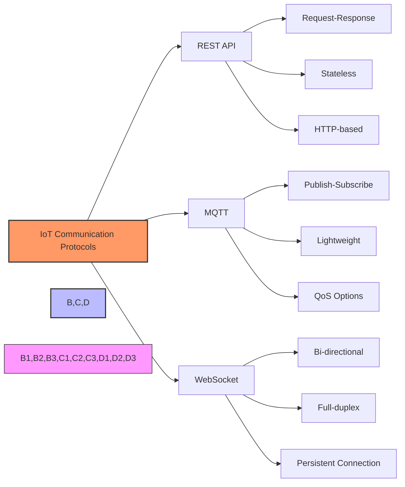

# REST API vs MQTT/WebSocket

## Protocol Comparison for IoT Systems

[Search for IoT Protocol Comparison Charts](https://www.google.com/search?q=rest+api+vs+mqtt+websocket+iot+comparison+chart&tbm=isch)

## Presenter Notes (ข้อมูลสำหรับผู้บรรยาย)

> **Key Takeaway**: การเลือกใช้โปรโตคอลที่เหมาะสมขึ้นอยู่กับลักษณะความต้องการของระบบ โดย REST API, MQTT และ WebSocket มีจุดเด่น-จุดด้อยต่างกัน และมักถูกใช้งานร่วมกันในระบบ IoT เพื่อเสริมข้อดีซึ่งกันและกัน

### เปรียบเทียบโปรโตคอล

| คุณสมบัติ | REST API | MQTT | WebSocket |
|----------|----------|------|-----------|
| รูปแบบการสื่อสาร | Request-Response | Publish-Subscribe | Full-duplex |
| การเชื่อมต่อ | ไม่ต่อเนื่อง | ต่อเนื่อง | ต่อเนื่อง |
| Overhead | สูง | ต่ำมาก | ปานกลาง |
| เหมาะกับ | การดึงข้อมูลเป็นครั้งคราว, การตั้งค่า | ข้อมูลเซนเซอร์, การแจ้งเตือน | Dashboard แบบ real-time |
| แบนด์วิดธ์ | ใช้มาก | ใช้น้อย | ใช้ปานกลาง |
| QoS | ไม่มี | มี (QoS 0,1,2) | ไม่มี |

### การเลือกใช้โปรโตคอลตามกรณี
- **REST API**: เหมาะสำหรับการร้องขอข้อมูลที่ไม่จำเป็นต้องได้รับการอัปเดตอย่างต่อเนื่อง เช่น การตั้งค่าอุปกรณ์ การดึงข้อมูลย้อนหลัง การเรียกใช้บริการ cloud
- **MQTT**: เหมาะสำหรับการส่งข้อมูลจากเซนเซอร์ที่มีข้อจำกัดด้านแบนด์วิดธ์และพลังงาน
- **WebSocket**: เหมาะสำหรับการสื่อสารแบบโต้ตอบทันที เช่น แชท หรือ dashboard แบบ real-time

ในระบบ IoT ที่สมบูรณ์ มักใช้โปรโตคอลแบบผสม โดยให้อุปกรณ์สื่อสารกับ gateway/broker ด้วย MQTT, ส่วน front-end/dashboard ใช้ WebSocket และการตั้งค่าหรือดึงข้อมูลจาก cloud services ใช้ REST API

**ศัพท์เทคนิค**: Request-Response Model, Publish-Subscribe Pattern, Bidirectional Communication, HTTP Overhead, REST Endpoints, QoS (Quality of Service), Persistent Connection, Long Polling, Full-duplex Communication
