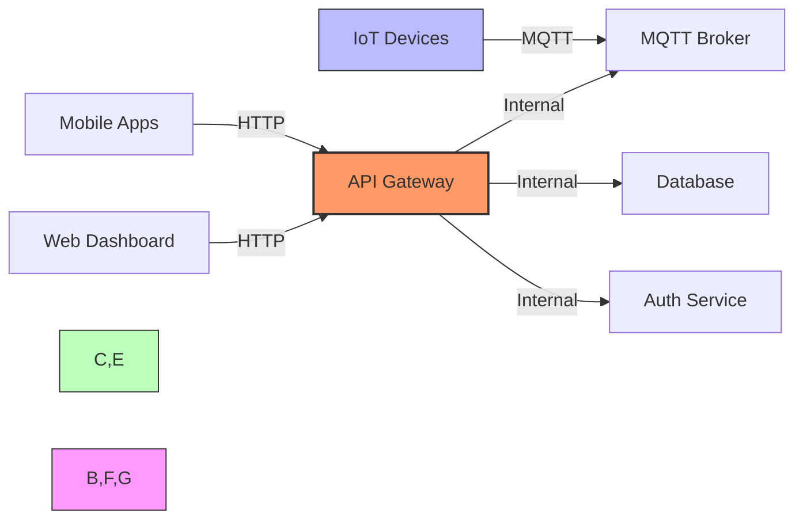

# API Gateway Implementation

## Setting Up an API Gateway for IoT



[Search for IoT API Gateway Architecture](https://www.google.com/search?q=iot+api+gateway+architecture+diagram&tbm=isch)

## Presenter Notes (ข้อมูลสำหรับผู้บรรยาย)

> **Key Takeaway**: API Gateway ทำหน้าที่เป็นประตูด้านหน้า (front door) สำหรับแอปพลิเคชันที่ต้องการเข้าถึงข้อมูลและบริการของระบบ IoT ช่วยในการจัดการการเชื่อมต่อ เพิ่มความปลอดภัย และสร้างมาตรฐานในการเข้าถึงข้อมูล

### บทบาทของ API Gateway ในระบบ IoT:

1. **Single Entry Point** - เป็นจุดเข้าถึงเดียวสำหรับทุกแอปพลิเคชันภายนอก ช่วยให้การจัดการง่ายขึ้น
2. **Protocol Translation** - แปลงโปรโตคอลระหว่าง REST API และโปรโตคอลภายใน เช่น MQTT
3. **Security** - จัดการการพิสูจน์ตัวตนและสิทธิ์การเข้าถึง
4. **Request Routing** - นำคำขอไปยังบริการภายในที่เหมาะสม
5. **Rate Limiting** - จำกัดจำนวนคำขอเพื่อป้องกัน DoS
6. **Logging & Monitoring** - บันทึกกิจกรรมและตรวจสอบประสิทธิภาพ
7. **Data Transformation** - แปลงรูปแบบข้อมูลระหว่าง JSON, XML, หรือรูปแบบเฉพาะ

### การพัฒนา API Gateway ด้วย Node.js และ Express:

```javascript
const express = require('express');
const mqtt = require('mqtt');
const app = express();
const port = 3000;

// เชื่อมต่อกับ MQTT broker
const mqttClient = mqtt.connect('mqtt://localhost:1883');

// Middleware สำหรับการพิสูจน์ตัวตน
app.use((req, res, next) => {
  const apiKey = req.get('X-API-Key');
  if (!apiKey || !isValidApiKey(apiKey)) {
    return res.status(401).json({ error: 'Unauthorized' });
  }
  next();
});

// API Endpoint สำหรับการดึงข้อมูลอุปกรณ์
app.get('/api/v1/devices', (req, res) => {
  // ตรวจสอบสิทธิ์และดึงข้อมูลจากฐานข้อมูล
  res.json({ devices: [/* ข้อมูลอุปกรณ์ */] });
});

// API Endpoint สำหรับการส่งคำสั่งไปยังอุปกรณ์
app.post('/api/v1/devices/:deviceId/command', (req, res) => {
  const { deviceId } = req.params;
  const { command } = req.body;
  
  // ส่งคำสั่งผ่าน MQTT
  mqttClient.publish(`devices/${deviceId}/command`, JSON.stringify(command));
  res.json({ success: true, message: 'Command sent' });
});

app.listen(port, () => {
  console.log(`API Gateway listening on port ${port}`);
});
```

### เครื่องมือสำหรับพัฒนา API Gateway:

1. **Express.js** - Lightweight framework สำหรับ Node.js
2. **Kong** - API Gateway แบบ open-source ที่ทำงานบน NGINX
3. **Amazon API Gateway** - บริการ managed API Gateway บน AWS
4. **Azure API Management** - บริการ API Gateway บน Azure
5. **Google Cloud Endpoints/Apigee** - บริการ API Gateway บน Google Cloud

การพัฒนา API Gateway ที่ดีต้องออกแบบโดยคำนึงถึงความปลอดภัย ความสามารถในการขยาย และประสิทธิภาพ

**ศัพท์เทคนิค**: API Gateway, Microservices, Reverse Proxy, Load Balancing, Circuit Breaker, Authentication, Rate Limiting, Request/Response Transformation, CORS (Cross-Origin Resource Sharing), JWT (JSON Web Token)
