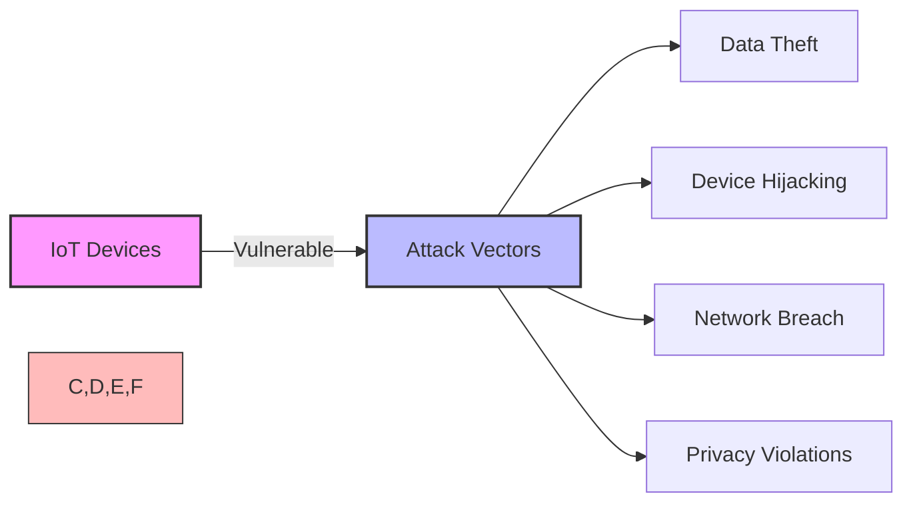

# IoT Security Introduction

## Understanding IoT Security Risks

IoT systems face unique security challenges due to:
- Resource constraints
- Diverse communication protocols
- Physical access vulnerabilities
- Large attack surface
- Long deployment lifetime

[Search for IoT security risk images](https://www.google.com/search?q=iot+security+risks+diagram&tbm=isch)

## Presenter Notes (ข้อมูลสำหรับผู้บรรยาย)

> Key Takeaway: ระบบ IoT มีความเสี่ยงด้านความปลอดภัยที่เฉพาะตัวและแตกต่างจากระบบ IT ทั่วไป เนื่องจากข้อจำกัดด้านทรัพยากร (เช่น หน่วยความจำ, พลังงาน), ความหลากหลายของโปรโตคอล, จำนวนอุปกรณ์ที่มาก, และอายุการใช้งานที่ยาวนาน ทำให้ยากต่อการอัปเดตความปลอดภัย

> ในปี 2023 มีการโจมตีอุปกรณ์ IoT มากกว่า 3.5 ล้านครั้ง โดยส่วนใหญ่มาจากการใช้รหัสผ่านเริ่มต้น (default credentials) และช่องโหว่ที่ไม่ได้รับการแก้ไข อุปกรณ์ที่ถูกบุกรุกสามารถถูกใช้เป็นส่วนหนึ่งของเครือข่าย botnet เพื่อโจมตีแบบ DDoS ได้

> ศัพท์เทคนิค: Attack surface, Zero-day vulnerability, Firmware security, Botnet, Man-in-the-middle attack, Brute force attack
