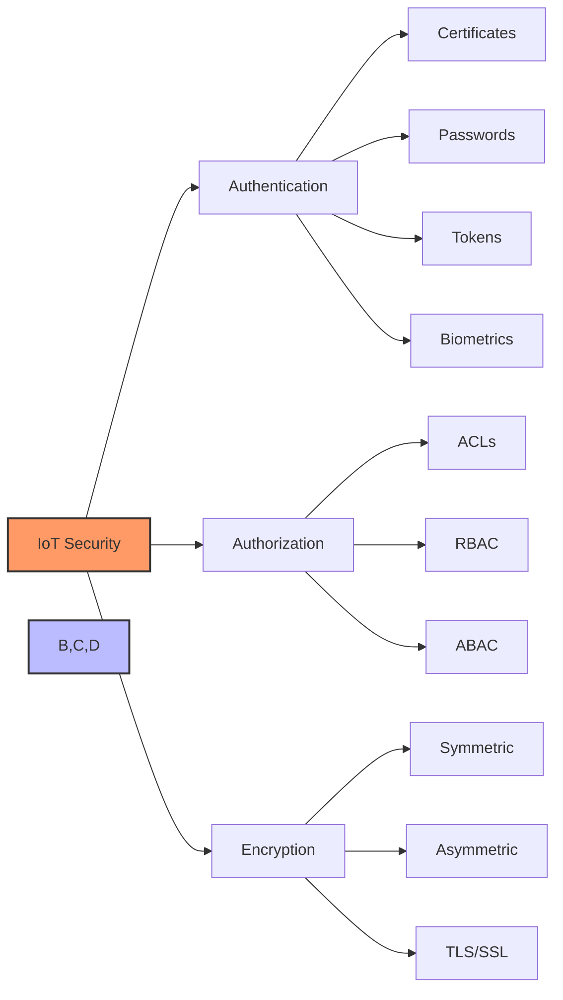

# Authentication, Authorization & Encryption

## The Three Pillars of IoT Security

- **Authentication**: Verifying identity (Who are you?)
- **Authorization**: Granting access rights (What can you do?)
- **Encryption**: Protecting data confidentiality (Can anyone else see?)

[Search for authentication authorization encryption images](https://www.google.com/search?q=authentication+authorization+encryption+diagram&tbm=isch)

## Presenter Notes (ข้อมูลสำหรับผู้บรรยาย)

> Key Takeaway: หลักการความปลอดภัยสำคัญสำหรับระบบ IoT ประกอบด้วยสามส่วนหลัก: การพิสูจน์ตัวตน (Authentication), การอนุญาต (Authorization) และการเข้ารหัสข้อมูล (Encryption) ซึ่งทั้งสามส่วนต้องทำงานร่วมกันเพื่อสร้างระบบที่ปลอดภัย

> การพิสูจน์ตัวตน - ตรวจสอบว่าอุปกรณ์หรือผู้ใช้เป็นใคร สามารถทำได้ผ่านรหัสผ่าน, ใบรับรอง X.509, โทเค็น หรือข้อมูลชีวมิติ  
> การอนุญาต - กำหนดสิทธิ์ว่าอุปกรณ์หรือผู้ใช้สามารถทำอะไรได้บ้าง มักใช้ ACLs (Access Control Lists), RBAC (Role-Based Access Control) หรือ ABAC (Attribute-Based Access Control)  
> การเข้ารหัส - ปกป้องความลับของข้อมูลที่รับส่ง มีทั้งการเข้ารหัสแบบสมมาตร (AES, 3DES) และแบบอสมมาตร (RSA, ECC)

> ศัพท์เทคนิค: Multi-factor authentication, Public Key Infrastructure (PKI), Access Control List (ACL), Role-Based Access Control (RBAC), Symmetric encryption, Asymmetric encryption, Transport Layer Security (TLS)
