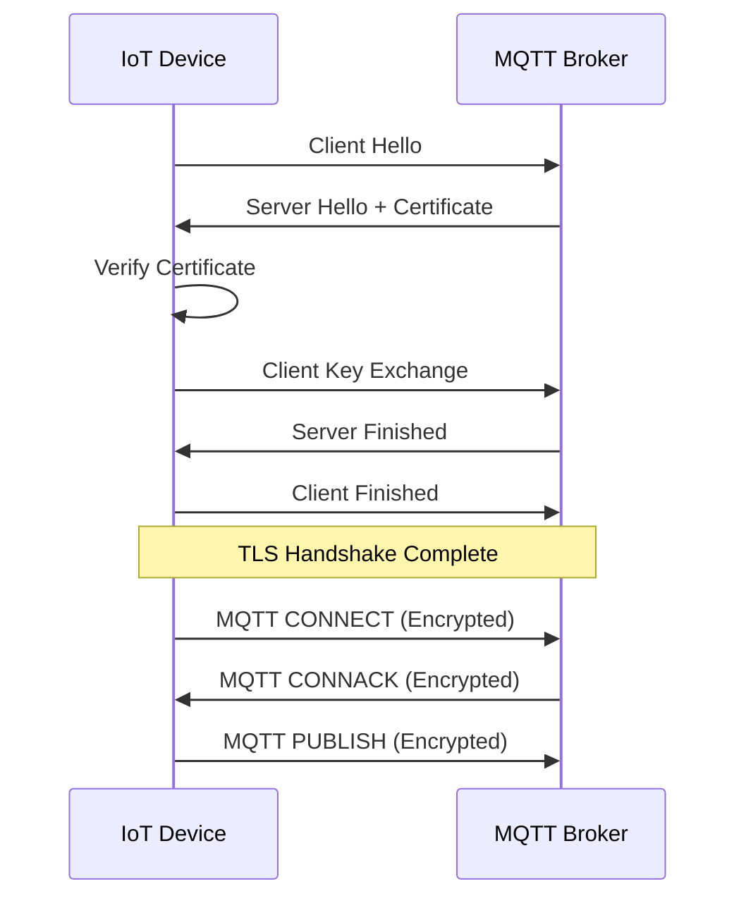

# Securing MQTT with TLS/SSL

## Implementing TLS/SSL for MQTT Broker

- TLS/SSL provides encryption, authentication, and data integrity
- Essential for securing MQTT traffic over the internet
- Requires certificate management (CA, server, client certificates)
- Configured at the broker and client levels

[Search for MQTT TLS SSL implementation](https://www.google.com/search?q=mqtt+tls+ssl+implementation+diagram&tbm=isch)

## Presenter Notes (ข้อมูลสำหรับผู้บรรยาย)

> Key Takeaway: การใช้ TLS/SSL กับ MQTT Broker เป็นสิ่งสำคัญมากสำหรับการรักษาความปลอดภัยการสื่อสารในระบบ IoT โดยช่วยเข้ารหัสข้อมูลที่รับส่งระหว่างอุปกรณ์และ broker ป้องกันการดักจับข้อมูลและการโจมตีแบบ man-in-the-middle

> ขั้นตอนการตั้งค่า TLS/SSL สำหรับ MQTT:
> 1. สร้างใบรับรอง CA, Server Certificate และ Client Certificate (หากต้องการ)
> 2. ตั้งค่า MQTT Broker ให้ใช้ TLS/SSL (เช่น port 8883 สำหรับ MQTT over TLS)
> 3. กำหนดพารามิเตอร์ความปลอดภัยเช่น TLS version (ควรใช้ 1.2 หรือ 1.3), Cipher Suites
> 4. ตั้งค่า MQTT client ให้รองรับ TLS/SSL และใช้ใบรับรองที่ถูกต้อง

> ข้อควรระวัง: การใช้ใบรับรองแบบ self-signed จะต้องมีการเพิ่มใบรับรอง CA ลงในอุปกรณ์ IoT ทุกตัว และหากมีอุปกรณ์จำนวนมาก ควรมีระบบจัดการใบรับรองที่ดี

> ศัพท์เทคนิค: Certificate Authority (CA), X.509 Certificate, TLS Handshake, Cipher Suite, Certificate Revocation List (CRL), Self-signed Certificate, Public Key Infrastructure (PKI)
