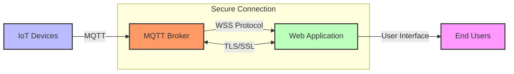

# WebSocket Secure (WSS)

## Configuring Secure WebSocket Communications

- WebSocket Secure (WSS) is the encrypted version of WebSocket protocol
- Uses TLS/SSL for encrypted communications (ws:// → wss://)
- Essential for real-time web applications interfacing with IoT systems
- Protects data integrity and confidentiality for browser-based dashboards

[Search for WebSocket Secure implementation](https://www.google.com/search?q=websocket+secure+wss+implementation&tbm=isch)

## Presenter Notes (ข้อมูลสำหรับผู้บรรยาย)

> Key Takeaway: WebSocket Secure (WSS) คือการใช้โปรโตคอล WebSocket ร่วมกับ TLS/SSL เพื่อสร้างการเชื่อมต่อแบบ real-time ที่ปลอดภัยระหว่าง web application กับ server มีความสำคัญอย่างมากสำหรับระบบ IoT ที่มีการแสดงผลข้อมูลแบบ real-time บนเว็บ

> การตั้งค่า WSS:
> 1. ต้องมีใบรับรอง SSL/TLS ที่ถูกต้องและติดตั้งบนเซิร์ฟเวอร์
> 2. เปลี่ยนการเชื่อมต่อจาก ws:// เป็น wss:// ในโค้ดไคลเอนต์
> 3. กำหนดค่า WebSocket server ให้ใช้งานร่วมกับ TLS
> 4. ตรวจสอบว่าทุกการเชื่อมต่อใช้ WSS เพื่อป้องกันการโจมตีแบบ mixed content

> ในระบบ IoT ที่มี Dashboard หรือหน้าควบคุมผ่านเว็บ เราสามารถใช้ WSS เพื่อเชื่อมต่อกับ MQTT Broker ผ่าน MQTT over WebSocket โดยใช้ไลบรารีเช่น Paho MQTT JavaScript Client ซึ่งจะช่วยให้เว็บบราวเซอร์สามารถรับข้อมูล real-time จากอุปกรณ์ IoT ได้อย่างปลอดภัย

> ศัพท์เทคนิค: WebSocket Secure (WSS), TLS/SSL, Mixed Content, MQTT over WebSocket, Secure WebSocket Server, Origin Policy, Cross-Origin Resource Sharing (CORS)
