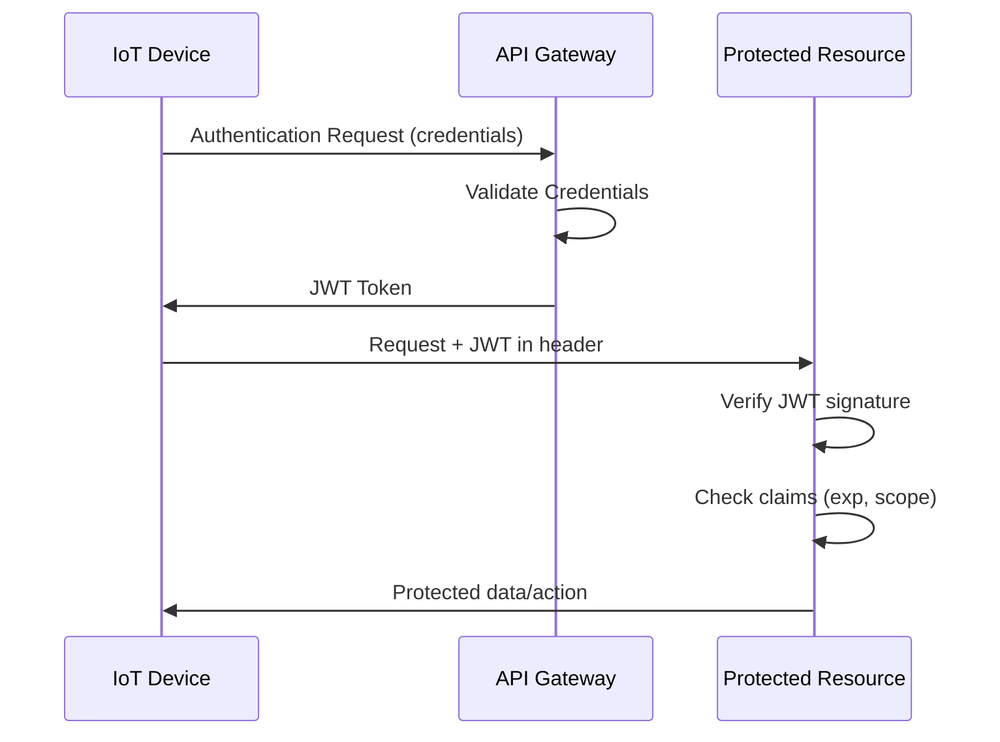

# JWT Authentication in IoT

## Implementing JSON Web Tokens for IoT Security

- JWT provides a compact, self-contained way to securely transmit claims
- Consists of Header, Payload, and Signature
- Useful for API authentication between IoT devices, gateways, and cloud
- Allows stateless authentication with minimal overhead

[Search for JWT authentication flow diagram](https://www.google.com/search?q=jwt+authentication+flow+diagram&tbm=isch)

## Presenter Notes (ข้อมูลสำหรับผู้บรรยาย)

> Key Takeaway: JSON Web Token (JWT) เป็นวิธีการพิสูจน์ตัวตนที่เหมาะสำหรับระบบ IoT เนื่องจากมีขนาดเล็ก สามารถใช้งานได้กับระบบแบบ stateless และสามารถรวมข้อมูลสิทธิ์ (claims) ลงในโทเค็นได้โดยตรง

> โครงสร้างของ JWT:
> 1. **Header**: บรรจุข้อมูลประเภทโทเค็นและอัลกอริธึมที่ใช้ (เช่น {"alg": "HS256", "typ": "JWT"})
> 2. **Payload**: บรรจุข้อมูล claims เช่น ID ของอุปกรณ์, สิทธิ์การเข้าถึง, เวลาหมดอายุ
> 3. **Signature**: ลายเซ็นดิจิทัลเพื่อตรวจสอบความถูกต้องของโทเค็น

> การใช้ JWT ในระบบ IoT:
> - อุปกรณ์ IoT จะได้รับ JWT หลังจากการพิสูจน์ตัวตนสำเร็จ
> - JWT จะถูกส่งไปพร้อมกับทุกคำขอ (request) เพื่อเข้าถึงทรัพยากรที่ต้องการการพิสูจน์ตัวตน
> - เซิร์ฟเวอร์ตรวจสอบความถูกต้องของ JWT โดยไม่จำเป็นต้องเก็บข้อมูลสถานะ (session)

> ข้อควรระวัง: ต้องกำหนดเวลาหมดอายุ (expiration time) ที่เหมาะสม และตรวจสอบการถอดรหัสโทเค็นเพื่อป้องกันการแก้ไขข้อมูล payload

> ศัพท์เทคนิค: JSON Web Token (JWT), Claims, Bearer Authentication, Token-based Authentication, JWT Signature, Base64URL Encoding, Expiration Time (exp), Issued At Time (iat)
