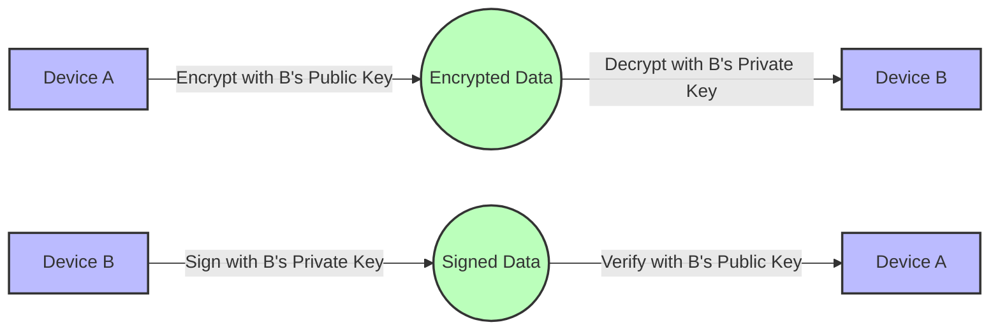

# Public/Private Key Encryption

## Implementing Asymmetric Encryption for IoT Data Security

- Uses key pairs: public key (encryption) and private key (decryption)
- Provides confidentiality, integrity, and non-repudiation
- Essential for device identity and secure communications
- Can be used for digital signatures to verify data origin

[Search for public private key encryption IoT](https://www.google.com/search?q=public+private+key+encryption+iot+diagram&tbm=isch)

## Presenter Notes (ข้อมูลสำหรับผู้บรรยาย)

> Key Takeaway: การเข้ารหัสแบบอสมมาตร (Asymmetric Encryption) โดยใช้คู่กุญแจสาธารณะและกุญแจส่วนตัว เป็นเทคโนโลยีที่สำคัญสำหรับการรักษาความปลอดภัยในระบบ IoT โดยเฉพาะสำหรับการพิสูจน์ตัวตนของอุปกรณ์และการแลกเปลี่ยนข้อมูลที่ต้องการความปลอดภัยสูง

> การทำงานของการเข้ารหัสแบบอสมมาตร:
> 1. **การเข้ารหัสข้อมูล**: ใช้กุญแจสาธารณะของผู้รับในการเข้ารหัส ซึ่งสามารถถอดรหัสได้เฉพาะด้วยกุญแจส่วนตัวของผู้รับเท่านั้น
> 2. **การลงลายมือชื่อดิจิทัล**: ใช้กุญแจส่วนตัวของผู้ส่งในการสร้างลายมือชื่อ ซึ่งสามารถตรวจสอบได้ด้วยกุญแจสาธารณะของผู้ส่ง

> ข้อควรระวัง:
> - อัลกอริธึมการเข้ารหัสแบบอสมมาตรใช้ทรัพยากรมากกว่าแบบสมมาตร จึงควรใช้เฉพาะกับข้อมูลขนาดเล็กหรือใช้ร่วมกับการเข้ารหัสแบบสมมาตร
> - ต้องมีระบบจัดการกุญแจที่ดีและปลอดภัย เช่น การใช้ Secure Element หรือ TPM เพื่อเก็บกุญแจส่วนตัว
> - ขนาดของคีย์มีผลต่อความปลอดภัย ควรใช้ RSA อย่างน้อย 2048 บิต หรือ ECC 256 บิตขึ้นไป

> ศัพท์เทคนิค: Asymmetric Cryptography, Public Key Infrastructure (PKI), RSA, ECC, Digital Signature, Key Management, Secure Element, Hardware Security Module (HSM), Trusted Platform Module (TPM)
