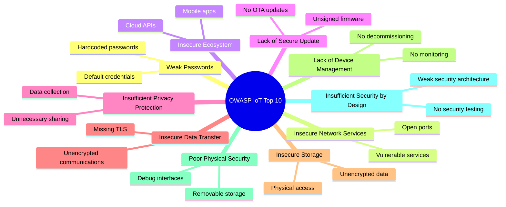

# OWASP for IoT Security

## Applying OWASP Security Principles to IoT

- OWASP IoT Top 10 identifies critical security risks for IoT systems
- Provides a framework for secure IoT development and deployment
- Addresses vulnerabilities throughout the IoT ecosystem
- Establishes security best practices for manufacturers and developers

[Search for OWASP IoT security principles](https://www.google.com/search?q=owasp+iot+security+principles&tbm=isch)

## Presenter Notes (ข้อมูลสำหรับผู้บรรยาย)

> Key Takeaway: OWASP (Open Web Application Security Project) มีการรวบรวมความเสี่ยงด้านความปลอดภัยที่สำคัญที่สุด 10 อันดับสำหรับระบบ IoT เพื่อใช้เป็นแนวทางในการออกแบบ พัฒนา และตรวจสอบความปลอดภัย

> OWASP IoT Top 10 ได้แก่:
> 1. **Weak, Guessable, or Hardcoded Passwords** - รหัสผ่านที่อ่อนแอ เดาได้ง่าย หรือฝังในโค้ด
> 2. **Insecure Network Services** - บริการเครือข่ายที่ไม่ปลอดภัย เช่น พอร์ตที่เปิดทิ้งไว้โดยไม่จำเป็น
> 3. **Insecure Ecosystem Interfaces** - ส่วนต่อประสานระบบที่ไม่ปลอดภัย เช่น Web, API, Cloud, Mobile App
> 4. **Lack of Secure Update Mechanism** - ขาดกลไกการอัปเดตที่ปลอดภัย เช่น การตรวจสอบเฟิร์มแวร์
> 5. **Use of Insecure or Outdated Components** - การใช้คอมโพเนนต์ที่ไม่ปลอดภัยหรือล้าสมัย
> 6. **Insufficient Privacy Protection** - การป้องกันความเป็นส่วนตัวที่ไม่เพียงพอ
> 7. **Insecure Data Transfer and Storage** - การส่งและจัดเก็บข้อมูลที่ไม่ปลอดภัย
> 8. **Lack of Device Management** - ขาดการจัดการอุปกรณ์ เช่น การตรวจสอบสถานะ
> 9. **Insecure Default Settings** - การตั้งค่าเริ่มต้นที่ไม่ปลอดภัย
> 10. **Lack of Physical Hardening** - ขาดการป้องกันทางกายภาพ

> แนวทางการประยุกต์ใช้:
> - ทำ Security Assessment โดยอ้างอิงตาม OWASP IoT Top 10
> - ใช้เป็น Checklist ในการออกแบบและพัฒนาระบบ IoT
> - ติดตามการอัพเดทของ OWASP เนื่องจากภัยคุกคามมีการเปลี่ยนแปลงตลอดเวลา

> ศัพท์เทคนิค: OWASP IoT Top 10, Secure by Design, Defense in Depth, Penetration Testing, Security Assessment, Threat Modeling, Security Development Lifecycle (SDL)
