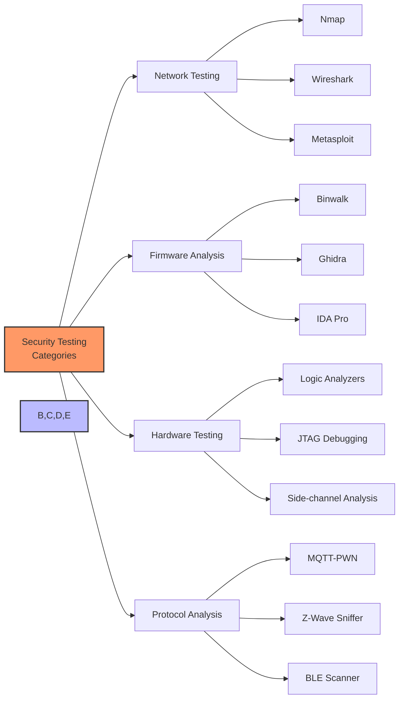

# Security Testing Tools

## Essential Tools for IoT Security Assessment

- Network scanning and vulnerability assessment
- Firmware analysis and binary inspection
- Protocol analysis and traffic inspection
- Hardware security testing

[Search for IoT security testing tools](https://www.google.com/search?q=iot+security+testing+tools&tbm=isch)

## Presenter Notes (ข้อมูลสำหรับผู้บรรยาย)

> Key Takeaway: การทดสอบความปลอดภัยของระบบ IoT ต้องใช้เครื่องมือหลากหลายประเภทเพื่อครอบคลุมช่องโหว่ทั้งในระดับเครือข่าย, เฟิร์มแวร์, ฮาร์ดแวร์ และโปรโตคอล

> **เครื่องมือสำหรับทดสอบความปลอดภัยเครือข่าย**:
> - **Nmap**: ใช้สแกนพอร์ตและบริการที่เปิดให้บริการบนอุปกรณ์ IoT
> - **Wireshark**: วิเคราะห์แพ็คเก็ตและการสื่อสารในเครือข่าย เพื่อตรวจหาข้อมูลที่ไม่ได้เข้ารหัส
> - **Metasploit**: เครื่องมือทดสอบการเจาะระบบแบบครบวงจร

> **เครื่องมือวิเคราะห์เฟิร์มแวร์**:
> - **Binwalk**: ใช้แยกไฟล์จากเฟิร์มแวร์และวิเคราะห์ส่วนประกอบ
> - **Ghidra**: เครื่องมือ reverse engineering จาก NSA สำหรับวิเคราะห์โค้ด
> - **Firmware-Analysis-Toolkit**: รวมเครื่องมือสำหรับวิเคราะห์เฟิร์มแวร์

> **เครื่องมือทดสอบฮาร์ดแวร์**:
> - **Logic Analyzers**: ใช้ตรวจจับสัญญาณบนขาของชิปและการสื่อสารระหว่างอุปกรณ์
> - **JTAG/SWD Debuggers**: ใช้เข้าถึงฟังก์ชันการดีบักของอุปกรณ์
> - **Bus Pirate**: เครื่องมือทดสอบและติดต่อกับอุปกรณ์ผ่านโปรโตคอลต่างๆ

> **เครื่องมือวิเคราะห์โปรโตคอล**:
> - **MQTT-PWN**: เครื่องมือสำหรับทดสอบความปลอดภัยของ MQTT broker
> - **BLE Scanner/Sniffer**: ใช้วิเคราะห์และดักจับการสื่อสาร Bluetooth Low Energy
> - **Z-Wave Sniffer**: วิเคราะห์การสื่อสารของอุปกรณ์ที่ใช้ Z-Wave

> ศัพท์เทคนิค: Penetration Testing, Vulnerability Assessment, Firmware Analysis, Reverse Engineering, Packet Sniffing, Side-channel Analysis, Static Analysis, Dynamic Analysis
