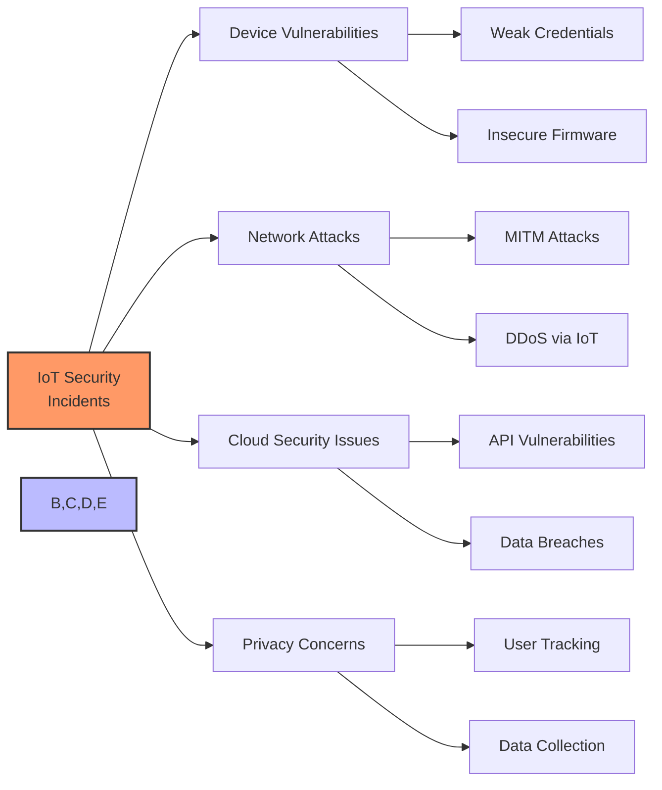

# IoT Security Case Studies

## Learning from Real-World IoT Security Incidents

- Mirai Botnet: 2016 DDoS attack using IoT devices
- Jeep Cherokee hack: Remote vehicle control demonstration
- St. Jude Medical cardiac device vulnerabilities
- Smart home devices privacy breaches

[Search for IoT security breach examples](https://www.google.com/search?q=major+iot+security+breaches+case+studies&tbm=isch)

## Presenter Notes (ข้อมูลสำหรับผู้บรรยาย)

> Key Takeaway: กรณีศึกษาการโจมตี IoT จากเหตุการณ์จริงทำให้เราเห็นภัยคุกคามและผลกระทบที่อาจเกิดขึ้นได้ ซึ่งช่วยให้เราสามารถเรียนรู้และป้องกันระบบของเราจากภัยคุกคามในลักษณะเดียวกัน

> **Mirai Botnet (2016)**:
> - เครือข่าย botnet ที่ควบคุมกล้อง IP, เราเตอร์ และอุปกรณ์ IoT อื่นๆ กว่า 600,000 เครื่อง
> - ใช้วิธีการ brute-force รหัสผ่านเริ่มต้น (default passwords) ที่ผู้ใช้ไม่ได้เปลี่ยน
> - สร้างการโจมตี DDoS ขนาดใหญ่ที่สุดในประวัติศาสตร์ในเวลานั้น
> - บทเรียน: ต้องเปลี่ยนรหัสผ่านเริ่มต้น และมีระบบอัพเดทเฟิร์มแวร์อัตโนมัติ

> **Jeep Cherokee Hack (2015)**:
> - นักวิจัยความปลอดภัยสามารถเข้าควบคุมรถ Jeep Cherokee ผ่านระบบความบันเทิง
> - สามารถควบคุมระบบปรับอากาศ, เครื่องเสียง, และแม้แต่เบรกและพวงมาลัย
> - ส่งผลให้ Chrysler ต้องเรียกคืนรถ 1.4 ล้านคัน
> - บทเรียน: การแยกระบบที่สำคัญต่อความปลอดภัยออกจากระบบที่เชื่อมต่อกับอินเทอร์เน็ต

> **St. Jude Medical Cardiac Devices (2017)**:
> - พบช่องโหว่ในเครื่องกระตุ้นหัวใจและเครื่องช็อกหัวใจอัตโนมัติ
> - แฮกเกอร์สามารถเข้าถึงและเปลี่ยนการทำงานของอุปกรณ์ได้
> - บทเรียน: อุปกรณ์ทางการแพทย์ต้องมีการรักษาความปลอดภัยระดับสูงเป็นพิเศษ

> **Ring Doorbell Privacy Issues (2019)**:
> - พนักงานบางคนของ Ring มีการเข้าถึงวิดีโอจากกล้องวงจรปิดของลูกค้า
> - ปัญหาการยืนยันตัวตนที่อ่อนแอทำให้แฮกเกอร์เข้าถึงกล้องได้ในบางกรณี
> - บทเรียน: ต้องมีนโยบายความเป็นส่วนตัวที่เข้มงวดและการยืนยันตัวตนแบบหลายปัจจัย

> ศัพท์เทคนิค: Distributed Denial of Service (DDoS), Botnet, Default Credentials, Remote Code Execution, Firmware Vulnerabilities, Supply Chain Attack, Zero-Day Vulnerability
