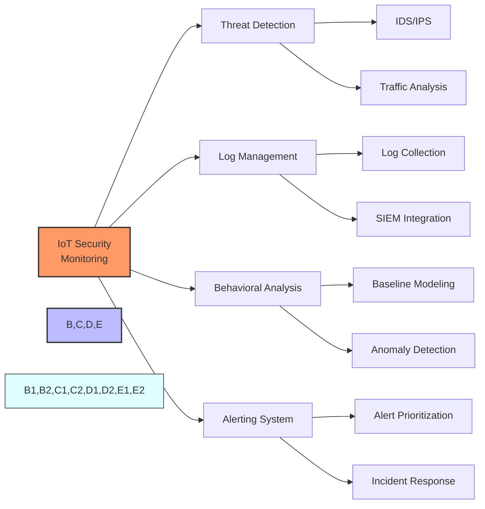

# Security Monitoring Systems

## Continuous Security Monitoring for IoT Deployments

- Real-time threat detection and alerting
- Behavioral analysis and anomaly detection
- Device health and status monitoring
- Security logs centralization and analysis

[Search for IoT security monitoring systems](https://www.google.com/search?q=iot+security+monitoring+dashboard&tbm=isch)

## Presenter Notes (ข้อมูลสำหรับผู้บรรยาย)

> Key Takeaway: ระบบเฝ้าติดตามความปลอดภัยที่มีประสิทธิภาพสำหรับ IoT ต้องสามารถตรวจจับและตอบสนองต่อภัยคุกคามแบบเรียลไทม์ ติดตามพฤติกรรมที่ผิดปกติ และจัดการกับเหตุการณ์ด้านความปลอดภัยได้อย่างรวดเร็ว

> **องค์ประกอบของระบบเฝ้าติดตามความปลอดภัย**:
> 
> 1. **การตรวจจับภัยคุกคาม (Threat Detection)**:
>    - ใช้ระบบตรวจจับและป้องกันการบุกรุก (IDS/IPS)
>    - วิเคราะห์ข้อมูลจราจรเครือข่ายเพื่อค้นหารูปแบบการโจมตี
>    - ใช้ Honeypot เพื่อล่อและศึกษาเทคนิคการโจมตี
> 
> 2. **การจัดการล็อก (Log Management)**:
>    - รวบรวมบันทึกจากอุปกรณ์ IoT, เกตเวย์, และระบบปลายทางต่างๆ
>    - เก็บล็อกไว้อย่างปลอดภัยเพื่อใช้วิเคราะห์และอ้างอิงในอนาคต
>    - เชื่อมโยงกับระบบ SIEM (Security Information and Event Management)
> 
> 3. **การวิเคราะห์พฤติกรรม (Behavioral Analysis)**:
>    - สร้างโมเดลพฤติกรรมพื้นฐาน (baseline) ของอุปกรณ์และระบบ
>    - ตรวจจับพฤติกรรมที่ผิดปกติ เช่น การรับส่งข้อมูลในเวลาที่ไม่ปกติ
>    - ใช้ Machine Learning ในการปรับปรุงการตรวจจับอัตโนมัติ
> 
> 4. **ระบบแจ้งเตือน (Alerting System)**:
>    - จัดลำดับความสำคัญของการแจ้งเตือน เพื่อลดปัญหา alert fatigue
>    - มีแนวทางตอบสนองต่อเหตุการณ์ที่ชัดเจน (Incident Response Plan)
>    - ส่งการแจ้งเตือนผ่านหลายช่องทาง เช่น อีเมล, SMS, แอปพลิเคชันมือถือ

> **การจัดการความปลอดภัยในระบบ IoT ขนาดใหญ่**:
> - ใช้ระบบเฝ้าติดตามแบบศูนย์กลาง (Centralized Monitoring)
> - จัดกลุ่มอุปกรณ์ตามประเภท ความเสี่ยง และความสำคัญ
> - สร้างแดชบอร์ดสำหรับมองภาพรวมของสถานะความปลอดภัยทั้งระบบ

> ศัพท์เทคนิค: Security Information and Event Management (SIEM), Intrusion Detection System (IDS), Intrusion Prevention System (IPS), Security Operations Center (SOC), Honeypot, Alert Fatigue, Correlation Rules, Mean Time to Detect (MTTD), Mean Time to Respond (MTTR)
