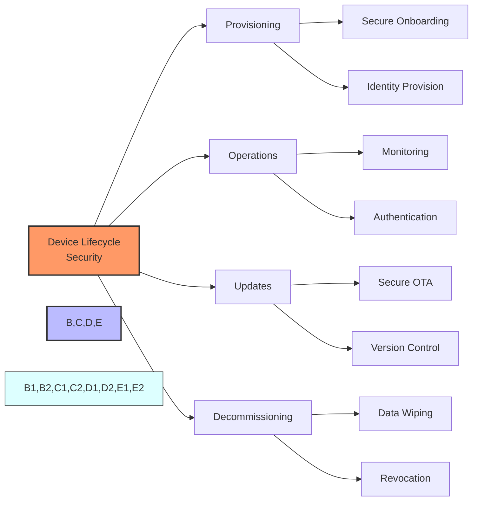

# Secure Device Management

## Managing IoT Devices Throughout Their Lifecycle

- Secure onboarding and provisioning
- Certificate and key management
- Secure firmware updates (OTA)
- Device decommissioning and data wiping

[Search for IoT device lifecycle management](https://www.google.com/search?q=iot+device+lifecycle+management+security&tbm=isch)

## Presenter Notes (ข้อมูลสำหรับผู้บรรยาย)

> Key Takeaway: การจัดการอุปกรณ์ IoT อย่างปลอดภัยต้องครอบคลุมทั้งวงจรชีวิตของอุปกรณ์ ตั้งแต่การเตรียมการใช้งานครั้งแรก การดำเนินงาน การอัปเดต ไปจนถึงการปลดระวาง โดยแต่ละขั้นตอนต้องมีการรักษาความปลอดภัยที่เหมาะสม

> **1. การเตรียมการใช้งานอย่างปลอดภัย (Secure Provisioning)**:
> - **Secure Bootstrapping**: กระบวนการเริ่มต้นที่ปลอดภัยเมื่ออุปกรณ์เปิดใช้งานครั้งแรก
> - **Device Identity**: การจัดการตัวตนของอุปกรณ์ด้วยใบรับรองหรือคีย์ที่ไม่ซ้ำกัน
> - **Zero-Touch Provisioning**: การตั้งค่าอุปกรณ์โดยอัตโนมัติแบบปลอดภัย โดยไม่ต้องการการตั้งค่าด้วยมือ
> - **Device Authentication**: การยืนยันว่าอุปกรณ์เป็นของแท้และได้รับอนุญาต

> **2. การดำเนินงาน (Operations)**:
> - **การตรวจสอบสถานะ**: ตรวจสอบสุขภาพและสถานะของอุปกรณ์อย่างสม่ำเสมอ
> - **การจัดการการเข้าถึง**: ควบคุมว่าใครหรืออะไรสามารถเข้าถึงอุปกรณ์ได้บ้าง
> - **การตรวจสอบกิจกรรม**: บันทึกและวิเคราะห์กิจกรรมของอุปกรณ์เพื่อตรวจจับพฤติกรรมที่ผิดปกติ
> - **การหมุนเวียนคีย์**: เปลี่ยนคีย์การเข้ารหัสตามระยะเวลาที่กำหนด

> **3. การอัปเดตเฟิร์มแวร์ที่ปลอดภัย (Secure Updates)**:
> - **OTA Updates**: อัปเดตเฟิร์มแวร์แบบไร้สาย (Over-the-Air)
> - **การตรวจสอบความถูกต้อง**: ตรวจสอบว่าเฟิร์มแวร์มาจากแหล่งที่เชื่อถือได้และไม่ถูกแก้ไข
> - **Rollback Protection**: ป้องกันการย้อนกลับไปใช้เฟิร์มแวร์เวอร์ชันเก่าที่มีช่องโหว่
> - **Fail-Safe Updates**: กลไกที่รับประกันว่าหากการอัปเดตล้มเหลว ระบบจะกลับไปใช้เวอร์ชันที่ทำงานได้

> **4. การปลดระวาง (Decommissioning)**:
> - **การลบข้อมูล**: ลบข้อมูลทั้งหมดจากอุปกรณ์อย่างปลอดภัย
> - **การเพิกถอนใบรับรอง**: ยกเลิกใบรับรองและสิทธิ์การเข้าถึงของอุปกรณ์
> - **การยกเลิกการลงทะเบียน**: ลบอุปกรณ์ออกจากระบบจัดการ
> - **การรีไซเคิล**: การจัดการอุปกรณ์ที่หมดอายุการใช้งานอย่างเป็นมิตรกับสิ่งแวดล้อม

> ศัพท์เทคนิค: Device Provisioning, Secure Bootstrapping, Certificate Lifecycle Management, Over-The-Air (OTA) Updates, Device Attestation, Secure Element, Hardware Security Module (HSM), Device Identity, Secure Boot, Trusted Execution Environment (TEE), Factory Reset
